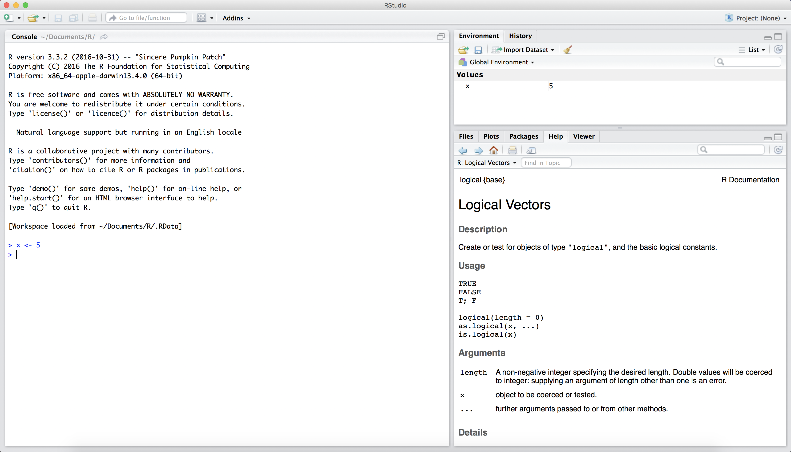
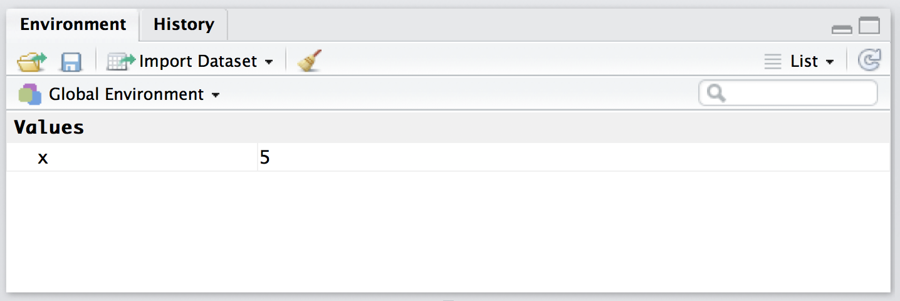
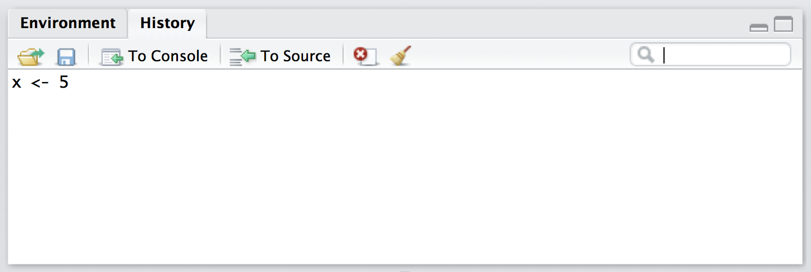

<span style="color:red"> In all assignments submitted for this course, rather than using scripts, you will be submitting a knitted HTML answer file (**saved as Computer-Assignment-1-#LastnameFirstname.html**) that performs the desired calculations and addresses the given tasks. Turn in your work via the assignment 1 on Canvas by 11:59 pm CST, a week after the discussion day.\span 

Please answer questions in the corresponding location in the answer document. Provide written responses to verbal questions in paragraphs of RMarkdown free text, like the one you are reading right now. In addition, present chunks of executable code using the syntax for R code chunks described in Part 3 below. It is best practice to provide comments in your code chunks that explain what your code does, especially for convoluted code chunks or complex functions. If a comment is long, add a line break and comment out a new line using `#` to improve readability. Be sure to periodically save the .Rmd as you work on the tasks to avoid losing your work. 

<span style="color:red">\span

<span style="color:purple">
**Goals:**

<span style="color:purple"> **1. Learn how variables, vectors, if statements, loops, and functions can be used to accomplish certain programming tasks in R. The features we will be covering today are the most basic tools for performing any type of computational task.** \span

<span style="color:purple"> **2. Get familiar with working in R Markdown. R Markdown makes it easy to embed code within a readable and presentable file. Assignments for this class will typically be completed in R Markdown. **
\span

If you are reading this in RStudio, then please click on Knit HTML, a key in the toolbar of this specific window (not the top window). An HTML file should open. This is almost always the easiest way to read an R Markdown file, such as this assignment. If you are already familiar with R Markdown, then you may read the code directly. Otherwise, we recommend you read the knitted HTML, since this assignment is designed to be read as such.

R is a freely available programming language commonly used in statistics and bioinformatics. You can download the R software package [here](https://cran.r-project.org/) for Windows, Mac OSX, or Linux. As an interface for R, we will be using RStudio (http://www.rstudio.com/ide/), which provides an interactive development environment (IDE) with many features that are helpful to beginner and advanced programmers alike.

R is a very practical introductory language with tremendous community support and plenty of helpful resources. Remember that if you're having trouble or want more details, the TA is here to help, and Google is your friend! One of the most important skills in programming is taking advantage of online resources to explore your computational questions.

Useful resources (among many):  
[Standard R Introduction](https://cran.r-project.org/doc/manuals/r-release/R-intro.pdf)  
[Google Developers Intro to R playlist](http://www.youtube.com/playlist?list=PLOU2XLYxmsIK9qQfztXeybpHvru-TrqAP)  
[R-help listserv archive](http://r.789695.n4.nabble.com/R-help-f789696.html)  
[StackOverflow](http://stackoverflow.com/)  

## Part 1: R as a Calculator

After you have opened RStudio, you should be presented with a screen that looks something like the following:  



On the lower left-hand side you should see the **R Console Window**. Ignore the other windows for the time being. The console is where you can actually type commands in R that will be interpreted and executed. (You type at the **command prompt**, after the `>`). Let's try out some basic features of R. Try typing **5 + 3** and then pressing **enter** in the R console. You should see output something like the following:  

```{r}
5+3
```

R can be used a calculator just like this for all basic arithmetic operators. The below we list some basic arithmetic operators:  

Addition: x + y  
Example:  
```{r}
1+4
```

Subtraction: x - y  
Example:  
```{r}
4-5
```

Multiplication: x*y  
Example:  
```{r}
7*3
```

Division: x/y  
Example:

```{r}
4/3
```

Exponentiation: x^y  
Example:
```{r}
2^3
```

Modular Division: x %% y  
Example:
```{r}
11 %% 2
```

Integer Division: x %/% y   
Example:
```{r}
11 %/% 2
```

It is often most convenient to deal with large numbers in scientific notation (something like $1.4x10^9$). In R, you can represent this value as either **1.4e9** or **1.4e+09**. 

## Part 2: Scripts

This interactive command prompt found in the Console window is a great place to test out R commands or run quick calculations. However, it would be very inconvenient if you had to type the same series of steps every single time you wanted to run something in R, especially if you wanted to repeat this process many times. Most actual programming in R is done with **scripts**, where a series of steps can be written once and then executed again and again. Scripts are a crucial part of computation, helping ensure reproducibility and documentation of bioinformatics experiments.

To open a new script in RStudio, click the **green and white document icon** at the top left of the RStudio window. From the drop down menu select **R Script**. An untitled text document should appear at the top left of your RStudio window right above the R console.
In this document you can type any command that works in R. Each command must be placed at the beginning of a new line; a long command can spill over onto multiple lines to improve readability, although parenthetical or logical structure must ensure that R knows that the command is incomplete (we'll see more of this later). Using RStudio, you can run either selected portions of your script or the entire document. To run a selected portion of your script, highlight the lines of interest and click **Run** (or <kbd>Command</kbd>+<kbd>Enter</kbd> for Mac, <kbd>Ctrl</kbd>+<kbd>Enter</kbd> for Windows). To execute the entire script, click **Source**. When working with R in scripts, you should use RStudio's scripting window as a workspace, and execute the commands using **Run** and **Source**.

The last important feature of scripting is the **commenting out** indicator, the **#** sign. Any characters typed between a **#** symbol and a line break are ignored by R when a script is executed. As such, frequent and liberal use of **#** comments is a useful way to annotate a script. This is important so that somebody else (including yourself months down the line) can open up a script and understand precisely what each portion of the code is doing. It is also good practice to start a new R script with a commented out section in which you identify yourself and the date, and write a brief summary of the code that follows (this can be added at the end of an assignment when you know what you've actually done, but it should always be there before a script is closed):

```{r}
#Winter 2022
#BIOS 11141 assignment1
#An intro to programming in R
#calculations in R; variables; logical expressions; control flow;

#Task 1.1: find the value of 
print("enter expression here")
```


<span style="color:red"> Questions are written in <span style="color:green">green</span>. You are expected to provide well-annotated code and fully-fledged answers in the answer document in the form of <span style="color:blue">blue text</span> and
```{r eval = FALSE}
code chunks #with comments when necessary
```
<span style="color:red">to all green questions for this assignment and for those that will come in the following weeks.</span>

## Part 3: R Markdown

This and all future assignments will be completed in R Markdown. R Markdown is another type of R file that RStudio can produce. In an R Markdown file, you can both typeset, format and embed code directly into an easily readable and presentable file.

<span style="color:purple"> For this section, please refer directly to the Rmd file to see the formatting syntax that will be presented. \span

R markdown is able to produce several file types, such as PDF, HTML and more. This assignment is set up to be knitted as an HTML file, as you can see on the header of the code.   

In R markdown, you can write free text just by writing in the white space of the R Markdown file in your command window. Line breaks will be introduced automatically both in the Rmd code and in the HTML file. On the other hand, paragraph breaks need special formatting to be introduced. To tell R Markdown to introduce a paragraph break end the previous paragraph with double space. For ease of grading, we ask that you provide answers in blue. To do so, write your answer like this: 

<span style="color:blue"> Your answer here \span

This syntax comes from HTML, and you can use any HTML command in this R markdown file. To make text **bold**, delimit it in double asterisks, and to make it in *italics*, delimit it in a single asterisk. You can also write mathematical expressions using LaTeX in R markdown, by delimiting the LaTeX expression by $ as in $\pi r^2$.

Most of your assignments will ask you to write R scripts, or R code. To directly embed those in the assignment, you can introduce an R code chunk by delimiting the R code with triple grave accents (the key next to 1 on your keyboard) followed by {r}
and then close the code chunk with triple grave accents again, as seen below. Alternatively, you can use the button in the toolbar (green square button with a c inside of it and an orange arrow to the left) from the toolbar above to insert a code chunk. The keyboard shortcut for this is <kbd>Ctrl</kbd>+<kbd>Alt</kbd>+<kbd>I</kbd> for Windows or <kbd>option</kbd>+<kbd>Command</kbd>+<kbd>I</kbd> for Mac.

```{r}
#This is a code chunk
```

This creates a line break and then introduces a gray code chunk, whose computations will be performed once you knit the Rmd file. The results will be shown in a white box right below it. Sometimes, when you are making plots, you might want to hide the code chunk and only show the plot. To do this, use the echo parameter, as seen below (don't worry about how to plot, as it will be taught at a later time. If you are curious, you can always check the documentation for the function plot in the help tab on the bottom right corner).

```{r, echo=FALSE}
plotx <- 1:10
ploty <- plotx*plotx
plot(plotx,ploty, type = "l", main = "Squares", xlab = "x", ylab = "x^2")
```

You can also insert in-line R code in R Markdown files. This is especially useful if you need to report some quantity in your text. For example, "The date and time right now is `r date()`". When the file is knitted, the expression delimited by ` will be substituted by what it evaluates to in R. You can run code chunks or individual lines of code using the different options contained in the dropdown menu next to the **"Run"** button on the toolbar on the top of this window. By default, the button runs the selected line or highlighted lines. Code can also be tested by copying and pasting into the console below. Of course, you can also just knit the entire file.

You can find a very convenient cheat sheet for R markdown online at: https://www.rstudio.com/wp-content/uploads/2015/02/rmarkdown-cheatsheet.pdf. Another good reference is the [Github Markdown Cheatsheet](https://github.com/adam-p/markdown-here/wiki/Markdown-Cheatsheet). And again,
don't forget that the internet and your TA can help you if you are having any trouble.

<span style="color:green"> 3.1  Write a line of code that will find the value of pi raised to the 5th power (R has a built in value for pi, called simply `pi`) in the box of R code chunk below (write your answer directly into the RStudio editor window). \span

<span style="color:green">  3.2  Using scientific notation, multiply four million by pi in the following code chunk. \span


## Part 4: Variable Assignment
R has 6 atomic classes, basic data that are the basis for any other data structure or value in R. We will not cover the raw class in this course. The remaining five classes are the following:

* *character* - Holds a character of text.  

* *numeric* - Known to C programmers as *double*. Holds floating point numbers (rational numbers). Note that 1 is in fact 1.0, and that Inf and -Inf are numbers in R (Inf is a number that is bigger than any other number, and -Inf is its negative). NaN covers undefined numbers such as 0/0. 

* *integer* - To specify an integer, append an L to the end of the number. This is inherited from the programming language C and signifies that the number is a **L**ong integer. For example, 1L is an integer corresponding to 1 exactly. Arithmetic operators coerce integer arguments to numeric type.

* *complex* - Complex is the class of complex numbers, such as 1+2i.

* *logical* - There are only two logical values in R, TRUE or T and FALSE or F (case sensitive). 

Missing values are represented in R by NA (`?NA` for more details).

<span style="color:green"> 4.1 Try summing logical values in the console (such as "TRUE + TRUE").<br>
a.) Explain how R handles such a query. Hint: in binary, what do 0 and 1 represent? <br> 
b.) What are some benefits of R handling these types of expressions as it does? \span

Variables in R are used to store and access numbers, strings of letters, data tables, or other objects for later use and manipulation. Creating and accessing values in variables is a task that is at the very heart of any programming project. In R, to create a variable, you must first assign some value to the variable. The command in R to do this is `<-`. This works by declaring the **Variable Name** on the **left** of the command, and the value to be stored on the **right** of the command. Think of it as an arrow pointing to the left.

Let's try this in R now. To assign the value 5 to the variable *x*, you simply type the following into your command prompt, and hit **enter** (alternatively, you can do the same directly in R markdown by enclosing the code in an R code chunk):

```{r}
x <- 5
```

Now, if you type `x` into the command prompt after assigning the variable and hit **enter**, you should see the following output:

```{r} 
x
```

*Note that variable assignments are carried through different code chunks in the same R Markdown file. However, variables assigned in an R Markdown file **DO NOT** automatically carry over to your RStudio environment!*

Now look at the top right section of RStudio under the Environment tab. As you can see, RStudio conveniently keeps track of the variables that are in our current workspace.

  
  
Also, if you click on the history tab, you can see that RStudio records each command that has been executed. These logging features can be incredibly helpful, especially when working on more complicated tasks. You can hit the **up arrow** key in the command prompt to bring up commands that you have previously entered.



Now try typing **y** into the R command prompt. You should see an output as follows:  

```{}
Error: object 'y' not found  
```

This means that the R session does not have any value attributed to the variable *y*. Variables can be assigned values using expressions or functions that reference other variables. For example, let's set *y* equal to twice the value of our *x* variable in our script:

```{r}
y <- 2 * x
y
```

R can also handle recursions (meaning you can define a variable or function referencing itself), as the following example shows.

```{r}
z <- 1
z
```

```{r}
z <- z + 1
z
```

```{r}
z <- z + 1
z
```

Notice that the assignment `z + 1 <- 2` (try it in the console) is not valid because "z+1" is not a valid variable name.  

<span style="color:green"> 4.2 Reassign *x* to a different value, and see how this affects *y*.<br>
a.) What is *y* actually storing: an expression or a value? <br>
b.) What is the difference between a variable storing an expression and storing a value? \span

What if you want to store more than one value in a variable? There are a number of ways to do this. Variables in R can store data in several different structures, including the **vector**, which provides a simple way to store many elements in the same variable. To create our first vector, we just need to type and execute the following command.

```{r}
myVec <- c(10, 20, 30, 40, 50, 60, 70, 80, 90, 100)
myVec
```

What we just did was using the `c()` function, which is short for "**c**ombine". All functions in R have associated Documentation pages, which are accessed by typing the following in the command prompt: `?function_name`. So, if you want to find out more about `c()`, you would type `?c` into the console. You should try this any time you need more information on a function, or if it is not behaving as you expect. We will cover functions more thoroughly later on.

Alternatively, you can use the search bar in the help tab of the bottom-right window in RStudio.

<span style="color:green"> 4.3	Explore the `c()` documentation page and the attributes of the newly-made `myVec`. Note that the *arguments* of a function are the data that you pass to that function when you call it (i.e. use it). With this in mind, briefly describe what the function `c()` does.  \span

Many R operators work on whole vectors like the one we just created (this is to say that they are *vectorized*). For example:

<span style="color:green"> 4.4  <br>
a.) Use the subtraction operator `-` to subtract `myVec` and the number `9`. Save this in a new variable so that the original myVec remains the same. <br>
```{r}
newVec <- myVec - 9
```

b.) Describe the behavior of this operation. \span

Many R functions also work on vectors. For example:

<span style="color:green"> 4.5 Use the `mean()` function (run `?mean()` for documentation if needed) to calculate and report the average of the entries in *myVec*. \span


Note that a vector specified by `c()` can only hold one kind of atomic class. For instance,
the vector c(1,"a", TRUE) would not be a valid vector in R, because it would hold numeric data, character data and logical data. You will see later that this also holds for matrices. Lists, on the other hand, are able to handle different classes in the same list.

Let's examine the structure of our first vector `myVec`. If we look in the Environment window, we can see something similar to the following in the entry for `myVec`:

```{r}
str(myVec)
```

What this tells us is that `myVec` is a **numeric** vector whose indices span from **1:10** (more on this in a little bit) and whose values consist of the multiples of 10 from 10 through 100, inclusive. In terms of size, vectors in R are one-dimensional. This is to say that they have one "spatial" dimension of **length**, which can be accessed using the `length()` function. If we wanted to find the *length* of *myVec*, then we would execute the following command:

```{r}
length(myVec)
```

From this output, we can see that the vector `myVec` has 10 elements in it. From before, we know that these values are 10, 20, 30, 40, 50, 60, 70, 80, 90, and 100. Now, we can obviously address the whole vector by simply typing `myVec`, but what if we want to work with specific values from our vector or even a range of values?

Once you have a vector defined, you can access individual elements of the vector as follows. **Note to those with exposure to other programming languages: index values in R start with 1 and not 0!** To obtain the first element in a vector, simply type the following:

```{r}
myVec[1]
```

This can be repeated for any value that you care about in the vector like the third value:
```{r}
myVec[3]
```

or the sixth value:
```{r}
myVec[6]
```

We have just executed our first **subsetting** or **indexing** operation. Subsetting is an operation in R that (as the name suggests) allows you to retrieve or address a *subset* of a given object's values. The values that you are addressing are determined according to that object's *indices*.

The **indices** of an object are a set of numbers that describe the positions of data within the object. For every vector, the set of indices can be thought of as a numeric vector (of the same length as the vector in question) that begins at `1` and ends at `length(object)`. To use the integer sequence notation from before, a convenient way to refer to an vector's indices is then `1:length(object)`.

<span style="color:green"> 4.6 What do the following indexing operations do? Explain each. <br>
a.) `myVec[-3]` <br>
b.) `myVec[3:5]` <br>
c.) `myVec[c(1,3,8)]` <br>
d.) `2*myVec`  <br>
e.) `myVec[1] <- 7.5` 

<span style="color:green"> 4.7 A normal resting heart rate for adults ranges from 60 to 100 beats per minute. <br>
a) Create a vector `heartRate` that spans the range of normal resting heart rates in intervals of 5bpm (use the `c()` function, or check out `?seq()`, which will be seen in part 5). <br>
b) The average ejection volume for adults is 67 mL/beat. Store this average ejection volume in a variable `averageEjection`. Using these data, create a vector `ejectionVolumes` containing the total amount of blood (in mL) ejected in *30 minutes* for each heart rate in your range. \span


## Part 5: Logical Expressions
R, like other programming languages, is able to evaluate logical statements like the following.

```{r}
2 == 2
```

```{r}
3 == 4
```

Here we are having R evaluate if the values on either side of the '==' operator are equal. Note that since many programming languages use '=' to assign a value to a variable, the '==' operator is used to assess equality.

Similar to "==", there are other comparison operators such as:

```{r}
2 != 2
```

```{r}
4 >= 1
```

```{r}
2 <= 4
```

```{r}
2 < 4
```

```{r}
3 > 4
```

<span style="color:green"> 5.1  Briefly describe what comparison each of the operators `!=`, `>=`, `<=`, `==`,`<`, and `>` do. \span

Some operators are slightly more complex. The AND operator `&&` evaluates multiple statements and determines whether those statements as a whole are TRUE or FALSE.
```{r}
x <- 4
(x > 3) && (x < 5)
```

In this case, both logical statements (x > 3) and (x < 5) are true. Therefore, the overall expression returns TRUE.  

If we were to say,  

```{r}
x <- 4
(x > 10) && (x < 5)
```

then R returns FALSE, since x, which has a value of 4, is not greater than 10. However, if we change the `&&` operator to `||`, a double pipe, the expression will return TRUE. 
```{r}
(x > 10) || (x < 5)
```

<span style="color:green"> 5.2 By playing around with the values of x and the values in the logical statement, propose the logical operator represented by ||. \span

Note that using parentheses with logical expressions often isn't necessary, but doing so can improve code readability and make the expression more transparent to programmers. Using parentheses might be necessary when writing logical expressions that combine `||` operators and `&&` operators.

Logical operators are also vectorized! Consider the following set of operations:

```{r}
multiplesOfFive <- seq(5, 50, 5) #create a vector of numbers *from* 5, *to* 50, in *steps* of 5
multiplesOfFive
notDivisibleByTen <- multiplesOfFive %% 10 != 0 #x %% y == 0 is asking, "is x evenly divisible by y?"
notDivisibleByTen
```

<span style="color:green"> 5.3 Explain the following operation in words: \span

```{r}
multiplesOfFive[notDivisibleByTen]
```

## Part 6: Control Flow: if, else
Logical expressions are an essential part of **control flow**. Control flow refers to programmatic decision-making that determines which statements will be executed, or how many times something should be executed. It seems complicated, but don't fret, control flow is not as daunting as it may appear.

Frequently, a programmer wants a particular command to be executed only when a certain condition is met. For a real world example, think of   unmanned radar guns. They capture the speed of each passing car, but they only send a ticket to the owner if the speed limit is exceeded. In an R script, this conditional logic can be represented in the following code. 

Note: this command is stretched over multiple lines and indented in order to improve transparency of the code; the lack of resolution of a parenthetical `()` or bracketed `{}` statement at the end of any given line means that R knows to search for the next line to resolve the entire command. Incorrect closure of a parenthetical or bracketed statement could lead you to execute a control flow statement prematurely; pay attention to this!

```{r}
carSpeed <- 65
speedLimit <- 60
if(carSpeed > speedLimit) { 
    print("Give ticket") 
} else { 
    print("Do nothing") 
} 
```

<span style="color:green"> 6.1	<br>
a.) Explain how this segment of code operates. <br>
b.) Change `carSpeed` to 67, and explain once again how flow is controlled. (Documentation on all control flow functionalities can be found with `?Control`). \span


<span style="color:green"> 6.2 Observe what happens when the following if/else statement is executed.
```{r}
if(1) {
    print("a")
} else {
    print("b")
}
```
<span style="color:green"> Why do we get this behavior? (Hint: what do FALSE == 0 and TRUE == 1 return?) \span

<span style="color:green"> 6.3 Write a nested if, else statement (an if, else statement *within* an if, else statement) of your choice. (Note: double-check to make sure that you're not writing two separate if, else statements.) \span


<span style="color:green"> 6.4 Assign a numeric value of your choice to a variable `bodyTemp`. Write an if, else statement that instructs patients to "seek medical attention" if their `bodyTemp` is above 40 degrees or below 35 degrees, or to "do nothing" if their temperature is within an acceptable range. \span


## Part 7: Control Flow - Loops
It's important to remember that computers are very good for automating tedious tasks. For example, say we wanted to multiply all of the numbers between 1 and 10 by 2. In R, we could do this by typing each command explicitly:
```{r}
1 * 2
```
```{r}
2 * 2
```
```{r}
3 * 2
```
...etc.

However, this is an exhausting approach and is prone to human error. A more elegant solution is to use a **for loop**. A for loop iterates over a fixed set of values or elements. With each iteration, the tasks are performed. Ignore the syntax for the moment, and in your command prompt input the following.

```{r eval = FALSE}
for(i in 1:10) {
    print(i*2)
}
```

<span style="color:green"> 7.1 <br>
a.) How/when is `i` defined? <br>
b.) Is it a global variable (hint: look at your environment window)?<br>
c.) Explain what this loop is doing. <br>
d.) If you define a variable `i` outside the for loop prior to its execution, does it affect the calculation? \span

Multiple commands can be executed within each iteration of a for loop:
```{r}
for(i in 1:3) {
  x <-  i + 10
  y <- x * 2
  z <- y^2    
  print(z)
}
```

Additionally, a loop can be nested within another one:
```{r}
for(i in 1:3) {
  for(j in 1:3) {
      print(j * i)
  }
}
```


<span style="color:green"> 7.2	Recall that the command `x %% y` gives you the value of x **mod** y. <br>
a.) How can you use this command to determine whether a number is even or odd? <br>
b.) With this information in mind, write a for loop that iterates from 1 to 10, and have it print out the even numbers between 1 and 10 *as well as the number 5.* \span <br>


<span style="color:green"> 7.3 R has a built-in variable `letters`, which is a vector containing all lower-case letters of the alphabet. Write a for loop that iterates *over letters* and prints each letter in upper-case (see `?toupper()` ). \span <br>


Another kind of loop is a while loop. A while loop keeps repeating some sequence of commands *while* some logical expression is true. The following gives an example of while loop.

```{r}
oranges <- 5
while (oranges > 0) {
    if (oranges > 1) {
        print("Someone just bought one of my oranges!")
        oranges <- oranges -1
        print(paste("I still have ", oranges, "oranges to sell!"))
    } else {
        print("Someone just bought one of my oranges!")
        oranges <- oranges -1
        print("I don't have any oranges to sell, :(!")
    }
}
```

Consider the following while loop:

```{r eval = FALSE}
x <- -10
while(x < 0) {
    print(x)
    x <- x - 1
}
```

It has been set to not evaluate (`eval = FALSE`), because if it were to evaluate, then it would result in an infinite loop.


<span style="color:green"> 7.4 `While()` loops will iterate as long as the expression within parentheses evaluates to `TRUE`. <br>
a.) What would happen if the code below were executed? Explain. <br>
b.) Modify the code so that it executes a functional while loop (that only prints a finite number of lines).  \span
```{r}
#x <- 2  
#while(x <=  5){  
#	print(x + x)  
#}  
```
## Part 8: Functions in R

### Structure and definition
Sometimes the task we want repeated occurs sporadically throughout our code. For these situations, a good solution is to write a function. **Functions are a *reusable* chunk of code designed to do a specific task.** In order to utilize a function, you call it by name and--when necessary--provide that function with arguments, which are the data that you pass to the function. We've already encountered several built-in functions such as `c()`, `length()`, `toupper()` etc. These functions take some data as their arguments, perform some operation(s) on those arguments, and *return* some result back to us. More on this later.

For now, let's take a closer look at the workings of a function. In R, all functions very broadly follow the same basic architecture (pseudocode follows):

```{r eval = FALSE}
funcName <- function(argument1, argument2, ..., argumentN) {
    ...operations performed on arguments to find output...
    return(output)
}
```

Let's break this down. A function definition is similar to the regular old assignment operation that we already know. First, we have our function name and the assignment operator `<-`. What we are assigning to this name, however, is not some data to create a variable but rather a *function*. We tell R that we want to write a function by typing `function()`. Very logical, sort of like when we created vectors with `c()`. 

#### Arguments and parameters
Next, we place in the parentheses a list of the variables that we want the function to have access to during the course of its execution. As we have mentioned before, the **data that you pass to a function when you call it** are known as the function's **arguments**. When you define **the number and nature of the arguments that the function will take**, you are setting that function's **parameters**. <span style="color:red"> So to summarize this, the **parameters of a function are set during the function definition, and they represent the arguments that the function will take**. These parameters stand in as "placeholders" for the arguments, which are provided to the function at the time of the function call.\span

#### Function body
The next part of the function definition consists of the "stuff" that our function will actually do. This is the body of the function. It can be as simple or as complicated as your heart desires. In this section, we can perform operations on our arguments, assign new (local) variables, and--perhaps most importantly--**`return()`** what we want to output from the function.

##### Return vs. print:
The difference between `return()` and `print()` is that printing something ALWAYS prints to the console. Let's consider the examples `parrot()` and `mime()` defined below, which both take one argument called `x`:

```{r}
parrot <- function(x) {
    print(x)
}

mime <- function(x) {
    return(x)
}
```

As we can see, the difference between these functions is that `parrot()` will **print** `x`, while `mime()` will **return** `x`. Let's examine the ramifications of this difference. In the following code chunk, we will simply *call* our functions with the number `5` as their argument.

```{r}
parrot(5)

mime(5)
```

All seems well, and `5` is printed to the console in both cases. The difference makes itself apparent when we use our functions to assign a value to a variable, as follows:

```{r}
a <- parrot(5)
b <- mime(5)
```

Both of our variables have successfully been assigned a value of 5, but only the `parrot()` call resulted in something being printed. The `mime()` call assigned the value silently. This is often the desired behavior.

<span style="color:green">
8.1 <br>
a.) Write a new function `findSquare(n)` that takes one argument (i.e. has one parameter `n`) and returns the square of that argument. <br>
b.) Call this function to calculate the square of 273 and **silently** assign it to a variable `squared`.</span>

Another important behavior of the `return()` statement is that **the function will terminate as soon as the first `return()` statement is executed.** Consider the example below:

```{r}
terminatePrematurely <- function(x) {
    return("Oops!")
    
    ## Converts input from decimal to binary
    n <- numeric(floor(log2(x)) + 1)
    while(x > 1){
        exp <- floor(log2(x))
        n[exp + 1] <- 1
        x <- x - 2^exp
    }
    n[1] <- x %% 2
    return(paste0(rev(n), collapse = ""))
}

terminatePrematurely(1089410839856315)
```

If that first line were not present, then we would have gotten a binary representation of the number that we passed as the argument to `terminatePrematurely()`, but instead we got an unfortunate case of premature termination because ***functions can only return one thing***. 

Functions are not limited to operations upon a single input number or variable. Instead, they can take multiple arguments, as in the following *multipleArgFunction()* example.

```{r}
multipleArgFunction <- function(x, y, z) {  
    return(x * y  + z)
}
```

<span style="color:green"> 8.2 How are provided inputs allocated to the variables in a function with multiple arguments? Compare and contrast the outputs of the following applications of *multipleArgFunction()*.  

```{r}
multipleArgFunction(3, 2, 1)  
```

```{r}
multipleArgFunction(1, 2, 3)  
```

```{r}
multipleArgFunction(z = 3, y = 2, x = 1)
```

<span style="color:purple"> As an aside: Functions do not necessarily require input arguments in order to work. For example, the following function: \span

```{r}
noInputFunc <- function() {
	return("It works!")
}
noInputFunc()
```

Also, you can call previously defined functions inside future functions. For instance:

```{r}
getSquare <- function(x) {
    return(x^2)
}
Raise4 <- function(x) {
    return(getSquare(getSquare(x)))
}
```

And see that

```{r}
3^4 == Raise4(3)
```

<span style="color:green"> 8.3 <br>
a.) Write a function "calcMean" that takes a vector of numbers as an argument and returns the mean of those numbers (Hint: see documentation for the `sum()` and `length()` commands). <br>
b.) Execute that function on a vector containing values 2 through 30. <br>
c.) Check your answer using R's built-in function `mean()`. \span

<span style="color:green"> 8.4 <br>
a.) Using a for loop convert each pH from 1-10 into concentrations of H+. Store the list of [H+] in a vector. Remember that pH is equal to the $-log10([H+])$. To define an empty vector of length n and fill in values one at a time, see the following example.\span
```{r}
myVec <- numeric(4)
print(myVec)
for(index in seq_along(myVec)) {
    myVec[index] <- index^2
}
print(myVec)
```

<span style="color:green"> b.) Now write a function called H_from_pH that, given a pH value, outputs the concentration of H+. Also, write an analogous function OH_from_pH to get [OH-] from the pH value. Remember that pH + pOH = 14. \span

<span style="color:green"> 8.5 Below is the formula for calculating standard deviation.<br>
a.) Translate this formula into an R function that returns the standard deviation of a vector of numbers. <br>
b.) Execute this function on a vector 1 through 200 with step size of 0.25 (review `seq()`). <br>
c.) Check that the results of your function match R's built-in function `sd()`.  \span

\[s_x = \sqrt{\frac{\sum_{i=1}^n (x_i - \overline{x})^2}{n-1}}\]

<span style="color:green"> Where $n$ is the number of data points, $\overline{x}$ is the mean of the $x_i$, and $x_i$ each of the values of the data. \span

