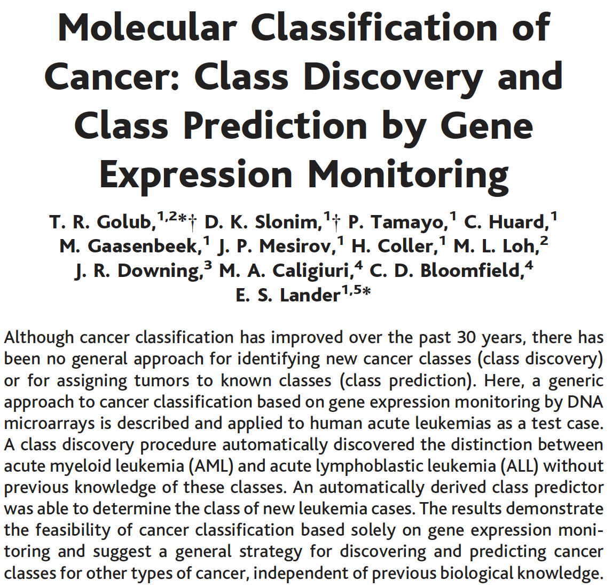
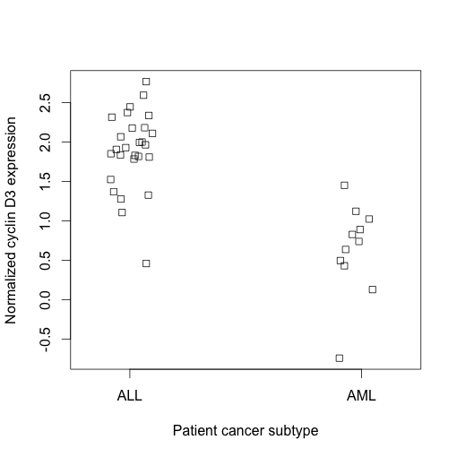
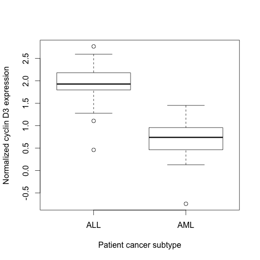
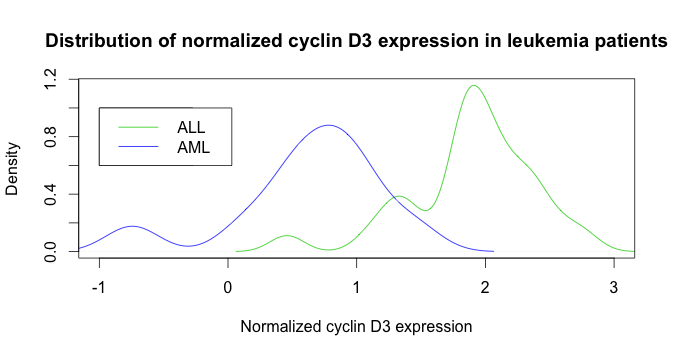
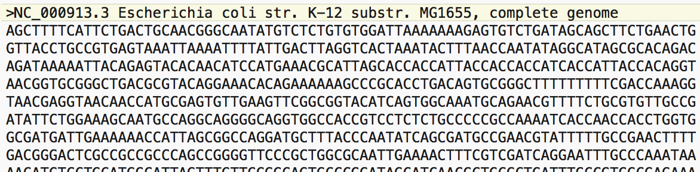

***Assignment Objectives:***

  1. Becoming familiar to work with dataframes
  
  2. Practice data analysis on biological published data
  
  3. Generate basic graphs for data analysis (stripchart, boxplot, histogram)
  
  4. Write and run basic DNA analysis scripts
  
---

<span style="color:red"> For your work in this assignment, please add your answers to the file entitled 'Ans2_LastnameFirstname.Rmd' and change the file name to have *your actual* first and last name. The answers are formatted to be in blue and all questions are in green in this document and in the answers document. Upload your answers file as an .Rmd and .html to Canvas by 11:59 p.m. CST Friday following discussion.\span  

In this assignment, you will learn how to make sophisticated graphics and perform preliminary data analyses in R in the context of a historically important set of gene expression data. R is a fantastic language for data-related graphics. To get a feel for some of the things R can do, cycle through the following demo by typing the following in the console (you can ignore the code that appears in the console).  

*demo("graphics")*

To remove all of the variables that were loaded into your work space and reset a parameter that was specified in the demo, execute the following two lines in the console:

```{r}
rm(list=ls())	
par(ask=FALSE)
```

For this module, we will use a set of data from a paper from Golub (a UChicago Pritzker alum!) et al. Science 1999, 286(5439):531-537. This classic paper describes the first use of microarray gene expression data to classify cancer cell subtypes that are difficult to distinguish morphologically, using acute leukemia as a proof of principle.  

Leukemia ordinarily affects two types of bone marrow cells - those destined to become certain types of lymphocyte white blood cells (acute lymphoblastic leukemia, or ALL), and myeloid cells destined to become red blood cells, platelets, and other types of cells (acute myelogenous leukemia, or AML). Prior to this paper, tests had been established that could distinguish ALL and AML in a diagnosis but no single test could effectively discriminate subtypes. Furthermore, analysis required specialized expertise and error rates were high. The authors of this study obtained gene expression data from bone marrow samples from 38 patients suffering from leukemia of an established subtype. From these gene expression data, the authors defined a set of 50 genes whose differential expression correlated most significantly with ALL versus AML status. The authors applied this 50-gene set as a predictive tool to distinguish ALL and AML in an independent set of 34 leukemia patients, in which they achieved 100% accuracy in subtype determination.  

Before we begin making **graphics** of our own, let's learn one way to **import** a data set using external packages, and acquaint ourselves with the data. Some of the exercises in this lab are adapted from the book by Wim P. Krijnen's: "Applied Statistics for Bioinformatics using R" and the "Bioinformatics Algorithms An Active Learning Approach" book, written by Phillip Compeau & Pavel Pevzne.  
## Part 1: Data frames
Matrices and data frames are the two primary ways to store tabular data as objects in R. Both a matrix and a data frame can store data in a tabular manner similar to a spreadsheet, but in a matrix all elements must be the same data type (e.g. all elements are numeric, or character strings) while a data frame can have different data types in different columns. Matrices are more memory efficient in storing data, and are required for many operations based on linear algebra. Data frames are more flexible and thus more convenient for many data handling activities. Data frames can also extend beyond two dimensions.

One common way to create a data frame is through the `read.table()` function, which can take a table of tab-delimited or comma separated values, such as a spreadsheet exported from Microsoft Excel, and create a new data frame object with the same tabular structure.  

An alternative is to create vectors for each column, and combine them into a table with `data.frame()`. The following contains information [](pax-db.org/) on several yeast proteins. The code below shows how to make a dataframe with the information.  

```{r}
id <- c("ENO2", "TDH3", "RPL39", "GAL4", "POL12", "EST2") #protein codes
protName <- c("enolase", "glyceraldehyde-3-phosphate dehydrogenase", "60S ribosomal protein L39", "regulatory protein Gal4", "DNA polymerase subunit alpha B", "telomerase reverse transcriptase") #full protein names
abundance <- c(24563, 22369, 16232, 32.3, 13.7, 0.01) #cellular abundance in ppm (part per million)
length <- c(437, 332, 51, 881, 705, 884) #number of amino acids
yeastProt <- data.frame(id, protName, abundance, length)
yeastProt
```

Similar to indexing values from a vector, we can pull particular values from a data frame using `[]` notation. 

<span style="color:green"> 1.1 Generate the following outputs (uncommented), and describe how to index values from a data frame.  

```{r}
yeastProt[1,]  # returns the first row 
#yeastProt[,1]  
#yeastProt[1,1]  
#yeastProt[1:3,c(1,3)]  
```

When working in data frames, there are two ways of referencing particular columns by name (use the `names()` function if you want a list of the column names of a data frame):

```{r}
yeastProt$abundance[1:3]

yeastProt[1:3, "abundance"]

```

Data frame slicing is useful for creating subsets of data that fit a particular criterion indicated by a logical operator. 

<span style="color:green"> 1.2 Explain what happens in the following command (uncommented). Hint: run 'yeastProt[,3] > 500' and observe the result. \span

```{r}
#yeastProt[yeastProt[,3] > 500, 3]
```

<span style="color:green"> 1.3 Rewrite the above command (`yeastProt[yeastProt[,3] > 500, 3]`) with two different notations for data frame indexing that generate the same output. Hint: we want a command with a different notation, not just a command with the same output. For ideas, look at the example 1 chunk above.\span

<span style="color:green"> 1.4 Construct a command that generates a new data frame named `filteredyeastProt` that consists of information from proteins with an abundance greater than 22000 ppm. \span

## Part 2: Getting familiar with the Golub data

We are going to interact with a subset of the original Golub et al. training data set, which contains normalized gene expression values for 3051 genes from blood cancer patients. Specifically, this set contains data from 27 acute lymphoblastic leukemia patients (ALL) and 11 acute myeloid leukemia patients (AML), which was derived from microarray analysis. The Golub data set comes from a 1999 study that showed how new cases of cancer could be classified by gene expression monitoring and proved this new concept of identifying cancer classes by epigenetics (the paper is available in the lab folder). 



This data is included as part of the **external package** "multtest." There are thousands of packages written by R users across the globe, which contain novel functionalities not present in the R base package. Many packages come with example datasets. In this case, the package “multtest” comes with the Golub et al. training data set. One large repository of external packages for bioinformatics is Bioconductor  (http://en.wikipedia.org/wiki/Bioconductor). We are going to use R to download Bioconductor, load the multtest library, and access the golub data. <span style="color:red">Run the chunk below. At some point, in your console, it will ask, "Update all/some/none? [a/s/n]:" and prompt a response. Type "a" into the console.\span


```{r}
if (!requireNamespace("BiocManager", quietly = TRUE))
    install.packages("BiocManager") #installs Bioconductor
BiocManager::install("multtest") #uses Bioconductor's installation tool to install the multtest package
library(multtest) #loads a library of tools included in the multtest package, including the golub data
data(golub) #loads the golub data set
```

You should now have three new objects loaded in your environment: *golub*, *golub.gnames*, and *golub.cl*. The matrix golub contains normalized microarray gene expression data for 3051 genes from the 38 leukemia patients (check with `dim(golub)`), with each row representing a gene and each column an individual. You can use the command `head(golub)` to take a quick look at how the data is formatted, without printing the entire matrix to your console. The matrix golub.gnames contains the same 3051 rows in an equivalent order to golub, providing gene names for each row. The numeric vector *golub.cl* contains 38 numbers in the same column order as golub, providing leukemia subtype identifiers for each patient; **0 codes for ALL and 1 codes for AML**.

<span style="color:green"> 2.1 Why must the gene names be placed in a separate matrix from the gene expression data? \span

What if we wanted to compare the average gene expression values between ALL and AML patients? To explore this, let's use one of the genes of interest from the Golub et al. study. One gene whose expression difference correlates strongly with ALL versus AML status is called cyclin D3. In order to find which row of the golub matrix represents expression values for this protein, we will have to find the right row in the golub.gnames matrix. If we knew the exact gene name, we could construct a logical expression slicing command that returns the row number with our gene of interest. Let's say, however, that we know we are looking for cyclin D3 but we don't know the exact syntax with which that gene is labeled. To find the correct row for cyclin D3, we will use the `grep()` search command which takes two primary commands: a character string query and a vector that you want to search. 

<span style="color:green"> 2.2 Use `?grep` to figure out how to write a query and find the row that contains the data for cyclin D3. (Hints: 1- Remember, a character string must be surrounded by quotation marks; 2- which column of golub.gnames do you want to search? 3- Set the ignore.case parameter to TRUE) \span

<span style="color:green"> 2.3 Using the information encoded in golub.cl, which columns in the golub matrix represent patients with ALL and which columns represent patients with AML? (Hint: Although you could just look at the vector, you can also try out a handy function called `which`) \span

Now that we know the row containing data on cyclin D3, we are ready to slice this row in the golub matrix to figure out the mean expression of ALL and AML patients. Look at golub.cl to determine which columns represent ALL versus AML patients based on the 0 / 1 coding. In the next several prompts, I will use xxxx to represent the row name that you have determined contains cyclin D3 above; 1:xx to represent the columns containing ALL patient data; and xy:38 to represent the columns containing AML patient data.

<span style="color:green"> 2.4 Utilizing the slicing methods learned from the above questions, calculate the mean expression of cyclin D3 mRNA in ALL patients and then in AML patients (answer should be two lines of code and two values). \span

In order to determine the statistical significance of this differentially expressed gene, we could conduct a simple t-test in R. This calculation reports the probability of the null hypothesis that the two sets of data are indistinguishable from one another, represented by the p-value. **Generally if the p-value is less than 0.05 we can reject the null hypothesis and conclude that the different values for the two groups did not just occur due to chance.**

<span style="color:green"> 2.5 Run the t-test on cyclin D3 expression values, report the p-value, and interpret its meaning.  

```{r}
t.test(golub[row_num,1:27],golub[row_num,28:38])
```

It would be useful to rapidly determine which genes in the data set have the largest difference in mean expression between ALL and AML patients, as these genes are likely to be useful in distinguishing cancer cell subtypes. If we wanted to compute the difference in mean expression of each gene for ALL and AML patients, we could do so with a for loop (uncommented) as discussed in the previous assignment:  

```{r}
#absMeanDiff <- vector()  
#for (i in 1:nrow(golub)) {
#    meanALL <- mean(golub[i , 1:xx])
#    meanAML <- mean(golub[i , xy:38])
#    absMeanDiff[i] <- abs(meanALL - meanAML)
#}
```

If you were to perform this operation on a much larger matrix, you would find that the computation is frustratingly slow. While there is nothing wrong with this formulation, it is not the most computationally efficient. R has a set of built-in looping functions that loop through columns or rows of a data table and repeat a specific function, much in the same way as the for loop above. These functions are within the **apply** family of functions. The usage of `apply()` is illustrated and explained in the following line of code that computes (uncommented) the mean expression of each gene for ALL patients:

```{r}
meanALL2 <- apply(golub[,1:27], 1, mean)
meanALL2 
```

In this command, we are assigning the iterative values of the apply loop to a new vector, meanALL2. In this apply loop, we are cycling through a subset of the golub matrix that corresponds to ALL patients. The second argument, the 1, tells the apply loop which dimension of the table to loop through. **In a two-dimensional table with rows and columns, 1 tells apply to loop through the rows of a table, while a 2 would tell apply to loop through columns.** Finally, the third argument, mean, tells apply which function should be iterated through each cycle of the loop. So this function will compute the mean of each **row** in from columns 1:xx and store the results in the meanALL2 vector.

<span style="color:green"> 2.6 Write a second apply command to compute the mean expression of each gene for AML patients. Then compute the absolute value of the difference in means between ALL and AML patients, and store the results in a new vector. \span

The last useful command for identifying differentially expressed genes is `order()`. To explore what `order()` does, observe the following sequence of commands.
```{r}
myVec <- c(105, 150, 102, 113, 98)
o <- order(myVec, decreasing=TRUE)
o
```

```{r}
myVec[o[1] ] <- "highest"
myVec[o[5] ] <- "lowest"
myVec
```

<span style="color:green"> 2.7 Given your understanding of the order command, construct a series of commands that will return the names of the 7 genes that have the largest absolute difference in mean expression between ALL and AML patients. \span

<span style="color:green"> 2.8 (a) Compare the top 5 differentially expressed genes to those that were used as the predictive set in Figure 3 of the Golub et al. paper which of these genes is not used in the set of predictors? \span

<span style="color:green"> 2.8 (b) Why might a ranking based solely on differences in mean expression be an inadequate metric for determining the best predictors of cancer subtype? \span

<span style="color:green"> 2.8 (c) What might be a better statistical metric for identifying genes to become part of the predictive set? (If you are stuck, feel free to browse the Golub et al. paper to see what they actually did, though this is not necessarily the only correct answer.)  \span

Finally, let's construct **factors** for the golub.cl categorization. Creating factors for a numerically encoded assignment vector essentially serves to tell R what we already know that 0 codes for ALL patients, and 1 codes for AML patients. By telling this to R, we will be able to efficiently make comparative graphs that illustrate gene expression differences between cancer subtypes. 

<span style="color:green"> 2.9 Execute the following command and explain what it is doing. \span
```{r}
# gol.fac <- factor(golub.cl, levels=c(0,1), labels = c("ALL","AML"))
```

The utility of this encoding will become apparent later on. But for now, we can see that we no longer need to remember the columns that correspond to ALL and AML patients. For example, for the t.test command used earlier, we can re-write it using our factors to partition columns by cancer subtype:

```{r}
#t.test(golub[xxxx,gol.fac=="ALL"],golub[xxxx,gol.fac=="AML"])$p.value
```

## Part 3: Making graphics in R

We will now introduce you to some of the basic graphics functions in R. To start, we will plot expression values from cyclin D3, whose gene expression values are in row 1042 as determined in Part 1. One of the most basic plotting functions in R is `plot()`. In its simplest incarnation, `plot()` will take a vector that is passed to it, and plot points one by one versus the vector index value. Various other arguments modify details of the plot, such as labels, colors, point symbol, and many more. 

<span style="color:green"> 3.1 Execute the following commands one-by-one, and explain what each additional argument adds to the resultant plot: \span 
```{r}
#plot(golub[1042,])  
#plot(golub[1042,], pch=2)  
#plot(golub[1042,], col=14)  
#plot(golub[1042,], type='l')  
#plot(golub[1042,], type='l', lty=2)  
#plot(golub[1042,], col=28, xlab="patient index", ylab="normalized cyclin D3 expression")  
#plot(golub[1042,], col=28, xlab="patient index", ylab="normalized cyclin D3 expression",  #main="Example of plotting in R")  
```

This method of illustrating the data is not the most graphically efficient. For example, plotting expression values versus patient index doesn't immediately convey the degree of differential expression between ALL and AML patients. It would be useful to instead cluster these points as a function of patient tumor type. We will do this with the `stripchart()` and `boxplot()` functions using the gol.fac encoding we devised earlier.

From now on, all charts you create are expected to have labeled axes and be visually compelling. You do not need to download or save your figures, but your code should be complete, meaning that the TA can execute your code in order and see the proper figures pop up in the 'Plots' window.

<span style="color:green"> 3.2 Read the help file on stripchart (execute ?stripchart and carefully read the explanation of the arguments), and modify the following command so that axes are properly labeled, the gene expression values are on the vertical axis (in other words, plot drawn vertically), and overlapping points are separated (or 'jittered') as in the example below. \span
```{r}
#stripchart(golub[1042,] ~ gol.fac)
```



If the `plot()` function is passed two vectors of values, it will create a scatter plot of the paired values. 

<span style="color:green"> 3.3a To illustrate this, use `plot()` to create a scatter plot of the gene expression values for two genes that are used as subtype predictors: IL-8 (row 2663 of golub) and IL-8 precursor (row 2664). Use the argument `col=gol.fac` to color points by cancer subtype. Then scatter plot the expression values of IL-8 and Zyxin (row 2124), another gene in the predictive set. \span

<span style="color:green"> 3.3b Visually compare the degree of correlation between expression values for IL-8 and IL-8 precursor to that of IL-8 and Zyxin. Explain your observations. \span

The next type of graphic is a histogram, created with the *hist()* command. We can then overlay a different distribution curves over the histogram to aid with interpretation. There are several commands that can add additional data to a preexisting graphic, including `curve(x, add=TRUE)`, `points()`, `lines()`, and `abline()`.

<span style="color:green"> 3.4 Use the commands below to create a histogram of the expression of cyclin D3 in ALL patients as seen below. Notice you will need to set the `freq` parameter of the `hist()` function to `FALSE`, and modify the second command to include the mean and standard deviation as detailed in the paragraph below. \span
```{r}
#hist(golub[1042,gol.fac=="ALL"])
#curve(dnorm(x, mean= , sd= ), add=TRUE)
```


This second command uses `dnorm`, which is one out of a family of functions that samples from defined probability distributions. We are telling the `curve()` function to evaluate `dnorm()` across a range of x. We then superimpose the resulting curve on our histogram in the plot window. Define the **mean** and **sd** arguments to be the mean and standard deviation of the data that is plotted, so we can see how closely the histogram conforms to a normal distribution (). We will learn an additional way to visualize the distribution of a data set below that is more amenable to comparisons of distributions between two data sets (e.g. the distribution of cyclin D3 expression in ALL versus AML patients).  

Sometimes it's nice to display two plots on one page. To do this, the line before the code for the graphics, we can use the command (uncommented):  

```{r}
#par(mfrow=c( #rows of plots, #columns of plots))  
```

For example, if we wanted to plot two graphs side by side, we would execute:

```{r eval=FALSE}
par(mfrow=c(1,2))
plot(rnorm(10),rnorm(10), xlab = "random var 1", ylab= "random var 2", main = "Plot 1 (on left)")
plot(runif(10),runif(10), xlab = "random var 1", ylab= "random var 2", main = "Plot 2 (on right)")
```

<span style="color:green"> 3.5 Modify your code from question 3.4 to plot a histogram and normal curve for the distribution of normalized cyclin D3 expression in AML. Use the par() function to display this plot and the plot of cyclin D3 expression in ALL from 3.4 in a 2x1 array (2 rows and 1 column). Which gene is more normally distributed? \span

<span style="color:green"> 3.6 Notice that the values on the x-axes are different for both of the histograms from question 3.5. It will be easier to visually compare the distribution of cyclin D3 expression between the ALL and AML groups if the range of x-values is the same for both plots. Copy the code from 3.5 but this time use the `xlim` argument for the histogram function and set the range of x values on both graphs to -1 through 3. Look at the documentation for the `hist()` function if you need help.  \span

In order to return to the default setting of one plot per page, we'll need to execute (uncommented):  

```{r}
#par(mfrow=c(1,1))  
```

A fellow aspiring bioinformatician suggests that the process of assembling a set of candidate genes could have been sped up by restricting the search to known oncogenes, which are genes that, when mutated, can contribute to a higher risk of developing cancer.

<span style="color:green"> 3.7a Use the `grep()` command to determine how many genes with the label "oncogene" are in the gene expression data set (Hint: remember to set ignore.case to TRUE and search within the right column). \span

<span style="color:green"> 3.7b Which of the oncogenes is the most highly differentially expressed? (Hint: you will need to use `apply` again). \span

<span style="color:green"> 3.7c Is this gene in the top 50 highly differentially expressed genes from the whole data set? (Hint: `%in%` is a logical operator that will tell you if an object is in a specified set. For example, try executing `4 %in% 1:10` and also `11 %in% 1:10`). \span

<span style="color:green"> 3.7d Is this gene one of the 50 identified as a predictive tool in Figure 3 of Golub et al? Provide a possible reason for this. (Note: recall that we have provided the Golub et al. paper for you in your lab folder, titled “Cancer-classification.pdf”)\span

As you delve into plotting in R, you will discover that there are many ways to subtly fine-tune the outputs of these basic graphic functions. However, as is normally the case with R, there are external packages that extend the limits of R's graphic capabilities even further. Two common external packages for plotting are lattice and ggplot2. These packages can reproduce many of the same types of graphics as the R base package, but with more flexibility and versatility. Many of the packages allow the production of graphics beyond that what is available in the basic package, such as images of maps, phylogenies, network connectivity, and a whole lot more. Learning how to apply the different graphic capabilities of R will allow you to generate highly informative and elegant figures for any number of future applications.



<span style="color:green"> 3.8 Use the `boxplot()` function in an analogous manner to the stripchart to produce a figure similar to the one above (Hint: you won't need as many arguments as you did for the stricpchart. You should have 4 or more arguments.). What additional information does a box plot convey? In which situations might a strip chart be preferred, and when might you choose to make a boxplot? \span

It would be useful to directly visualize the distributions of cyclin D3 expression for ALL and AML patients on the same graphic in order to observe the overlap in their distributions. 

One way to do this is as follows:
```{r}
#hist(golub[1042,gol.fac=="AML"], freq=FALSE, col=4, xlim=c(-1,3),
#     xlab = "Normalized cyclin D3 expression",
#     main="Distribution of normalized cyclin D3 expression in leukemia patients")
#hist(golub[1042, gol.fac=="ALL"], freq=FALSE, col=3, add=TRUE) #without the `add` parameter this historgram would plot on a seperate canvas
#legend(x=-1,y=0.7, legend=c("ALL","AML"),pch=15, col=c(3,4))
```

As you can see, plotting two histograms in this fashion is difficult regardless of the order in which you add the distributions, one distribution will crop out the other in certain bins. Let's explore an alternative method for illustrating these two distributions.  

The `plot()` function that we used in this assignment can take more than just vectors of values as an input. There are functions in R that transform data in a particular way and the results of these functions can then be passed to the `plot()` function. An example of this is the kernel density function, `density()`. Executing the `density()` command in the following manner will describe a kernel density description of the cyclin D3 gene expression values for ALL patients:  

```{r}
#density(golub[1042,gol.fac=="ALL"])
```

<span style="color:green"> 3.9 Use `plot()` on the density command to create a graphic illustrating the overlap in distributions of cyclin D3 expression between ALL and AML patients like the one shown below. After a plot window has been opened with the first set of data, a second distribution can be layered over the plot with the `lines()` function, which has the same usage as `plot()`. Finally, use the legend command to place a legend on your plot illustrating which color corresponds to which leukemia class. See the histogram example above for the usage of xlim and legend. \span
”


<span style="color:green"> 3.10 Explain how to read the density distribution you plotted in question 3.9. For example, how would you use the plot to get the probability of AML patients that have a normalized cyclin D3 expression within a specific range?

## Part 4: Basic DNA analysis

R can be a powerful tool to carry out analyses common in bioinformatics. Some well known bioinformatics packages for R are the Bioconductor set of R packages ([www.bioconductor.org](www.bioconductor.org)), which contain several packages with many R functions for analyzing biological data sets such as microarray data, and the SeqinR package ([https://cran.r-project.org/web/packages/seqinr/index.html](https://cran.r-project.org/web/packages/seqinr/index.html)), which contains R functions for
obtaining sequences from DNA and protein sequence databases--and for analyzing DNA and protein sequences.  

For this part, we're going to focus on computational analysis of biological sequence data (i.e., genome sequences). Many authors have written specialized packages for R that don't come with the standard R installation. We need to install and load the SeqinR package before we can use it. Execute the following commands in the command prompt:

```{r eval = FALSE}
install.packages('seqinr', repos='http://cran.us.r-project.org')
library("seqinr")
```

```{r echo = FALSE, message = FALSE}
#loads the "seqinr" library into the R Markdown environment
require("seqinr")
```

A common file format for storing nucleotide and amino acid sequences is the **FASTA** format, which can store one or more sequences along with their accompanying metadata. It begins with a single-line description starting with a ">" character followed by lines of the sequences themselves. Here is an example of a FASTA file for a nucleotide sequence:  


Indeed, we can see that there is a descriptive header line containing the accession number for this particular sequence, the name of the particular organism, and the fact that this is a complete genome for the organism. This is followed by the identities of the bases in the E. coli genome. Before we can read our COVID FASTA file into R, we need to tell R where to find this file. <span style="color:purple"> Go to the "Session" menu at the top of R Studio window, select "Set Working Directory" and then "Choose Directory". Select whichever folder you saved the covid19.fasta file in. (Note: you can also do this directly from the R console with the `setwd()` command. For example, `setwd(~/Desktop)` would set the working directory to the desktop. You can also check your current working directory with the `getwd()` command.)

Now you can read the COVID FASTA format file into R using the `read.fasta()` function from the SeqinR package: \span

```{r}
covid <- read.fasta(file="covid19.fasta")
```

The command above reads the contents of the FASTA format file covid19.fasta into an R object called covid. Let's look at what kind of data is stored in covid:
```{r}
class(covid)
```

The `class()` function tells us that covid is a list variable, so let's cover a brief introduction to list variables in R before going on.

<span style="color:green"> 4.1 Define a vector in R called *myvec* containing the integers between 7 and 21. Next, use indexing to replace the third entry of *myvec* with the character string "Hi" (remembering to include the quotation marks to get the proper string format). Print *myvec*. What happened to the elements of the vector? Why do you think this happened? \span

The list datatype is somewhat analogous to vectors in that lists are "one-dimensional" objects, meaning that they have a `length()` attribute and one set of indices. However, lists differ from vectors because a list's elements do *not* have to share a common type. In fact, **list elements can be pretty much anything**. Consider the list constructed below:

```{r}
motleyCrew <- list(char = c("a", "b", "c"), num = 1:7, func = sample, logic = TRUE, missing = NA, numberList = list(one = 1, two = 2, three = 3))
```

```{r}
length(motleyCrew)
motleyCrew[1]
motleyCrew[c(2,5)]
motleyCrew[6]
```

As we can see from `length(motleyCrew)`, this is a 6-element list. Element 1 is a character vector, element 2 is a numeric vector, element 3 is a function, element 4 is a logical value (TRUE), element 5 is a missing value, and element 6 *is another list!* A motley crew indeed. Indexing a list can be done in a similar fashion to indexing a vector, but with one interesting feature:

**A list element accessed using a single set of square brackets**
```{r}
class(motleyCrew[1])
```
**is also of list type.**

If we wanted to get at that "b", for example, we *cannot* do the following:
```{r}
motleyCrew[1][2]
```

Instead, we need to use ***double square brackets*** to address a list element as its original type.

```{r}
class(motleyCrew[[1]])
motleyCrew[[1]][2]
```

<span style="color:green"> 4.2 Write a function that takes in a list and prints out what type of object is stored in each element of the list. Test out this function on `motleyCrew`. Hint: use a for loop and the `class()` function. \span

As you may have noticed, this list has an attribute that we have not really encountered in the objects that we have worked with so far: each element of the list has a name. To address the names of an object (either to retrieve or to assign), we can simply use the `names()` command on the object in question:

```{r}
names(motleyCrew)
```

This command returns the names of the object as a character vector.

We can use the names of the object to subset it as well. For this list, there are a couple of ways that we can do this, including:

```{r}
motleyCrew$logic
motleyCrew["logic"] #note that this is stil a list object, unlike the above
```

The variable covid is an R list object, and the first element of the covid list object contains the RNA sequence we want to analyze. As we have learned, we can access this first element using double square brackets. Let's store the sequence for the covid virus in a variable `covid_seq` by doing the following assignment:

```{r}
covid_seq <- covid[[1]]
```

The variable covid_seq is a *vector* containing the nucleotide sequence. Each element of the vector contains one nucleotide of the sequence.

<span style="color:green"> 4.3 Using the `length()` function, determine the total number of nucleotides in the covid virus genome sequence. \span

<span style="color:green"> 4.4 Print out the last 56 nucleotides of the covid genome sequence. \span


### Counts and Frequencies
An obvious first analysis of any genome sequence is to count the number of occurrences of the four different nucleotides ("A", "C", "G", and "T"). Before we get to doing that, take a look at the code below to get an idea of one way we can do this using tables:

```{r}
names <- c("Mary", "John", "Ann", "Sinead", "Joe", "Mary", "Jim", "John", "Simon")
table(names)
```

We can store the table produced by the function `table()` in a variable by typing:

```{r}
mytable <- table(names)
```

To access elements in a table variable, we need to use double square brackets, just like accessing the elements in a list. For example, to access the fourth element in the table (the number of children named John), we type:

```{r}
mytable[[4]]
```

Alternatively, we can use the name of the fourth element in the table (John) to find the value of that table element:

```{r}
mytable[["John"]]
```

A basic property of genetic sequences which can be quite useful to know is the frequency of each of the four nucleotides. In this section, we ask you to use your knowledge of R to write functions which will be able to do so.

<span style="color:green"> 4.5 Find the individual nucleotide counts for the covid genome. What would the counts be for a DNA strand complimentary to this one? \span

<span style="color:green"> 4.6 Write a pair of functions called `frequencyPyrimidine()` and `frequencyPurine()` such that, given a nucleotide sequence, they will output the respective frequencies of pyrimidines and purines. \span  

<span style="color:purple"> According to [ThermoFisher Scientific](https://www.thermofisher.com/us/en/home/references/ambion-tech-support/rna-tools-and-calculators/dna-and-rna-molecular-weights-and-conversions.html), the molecular weights of A, T, C, and G, respectively, are 313.2, 304.2, 289.2, and 329.2 amu for DNA. For RNA, the respective weights for A, U, C, and G are 329.2, 306.2, 305.2, and 345.2 amu. \span

<span style="color:green"> 4.7 (a) Why are the masses of Ribonucleotide Monophosphates and Deoxyribonucleotide monophosphates different?  \span

<span style="color:green"> (b) For a first application of the ideas from 2.2, write a function called `seqWeight()` that, given a nucleotide sequence, outputs its weight. Your function should have an optional parameter *type* that by default is set to type = "DNA". This can be accomplished by simply providing `type = "DNA"` in the list of parameters during function definition. But, if type = "RNA", then it interprets seq to be an RNA sequence and outputs the appropriate weight. \span  

<span style="color:green"> (c) To test your function, report the weight of the following DNA sequence:
\span  
```{r}
seq <- c("g", "a", "t", "a", "t", "t", "c", "g", "g", "a", "g", "a", "t", "a") 
```

### Complementary Strand
In bioinformatics, since a single strand of DNA usually gives all the information necessary about its complementary strand, DNA sequences are represented as single strands in databases. Sometimes, however, it is relevant to consider the complementary strand of a DNA sequence, and for that one has to construct the complementary strand. First, note that you will need to change each base for its complementary base pair. Second, a complementary strand runs in the reverse direction of the strand which it complements, and it is therefore also necessary to reverse the direction of the DNA sequence.

<span style="color:green"> 4.8 Write a function `compStrand()` such that, given a DNA sequence, it outputs the complementary strand. *(Note: The convention for writing any nucleotide sequence is to go from the 5' to 3' end. Keep this in mind as you determine how to report the complimentary sequence.)* \span

### GC Content of DNA
One of the most fundamental properties of a genome sequence is its **GC content**, the fraction of the sequence that consists of Gs and Cs (as opposed to As and Ts). <span style="color:purple"> The GC content can be calculated as the ratio of the bases in the genome that are Gs or Cs to the total number of bases in the sequence (i.e., the length). \span 

<span style="color:green"> 4.9 Write a function called `GC_Content()` that will take in as its argument a nucleotide sequence and then return its GC content. Test your function on the covid virus sequence. What is the GC content for the covid virus genome? SeqinR has a built in function `GC()` which gives the fraction of bases in the sequence that are Gs or Cs. Does the `GC()` function give you the same output as your `GC_Content()` function for the covid genome? \span

We just found the GC content of the whole covid virus genome, but there is probably local variation in GC content within the genome. That is, some regions of the genome sequence may have GC contents quite a bit higher than your result from exercise 2.5, while some regions may have GC contents that are quite a bit lower. <span style="color:blue"> Local fluctuations in GC content within the genome sequence can provide interesting information, such as cases of horizontal gene transfer  ([https://en.wikipedia.org/wiki/Horizontal_gene_transfer](https://en.wikipedia.org/wiki/Horizontal_gene_transfer)) or biases in mutation. \span

If a chunk of DNA has moved via horizontal transfer from the genome of a species with low GC content to a species with high GC content, the chunk of horizontally-transferred DNA could be detected as a region that is unusually low in GC content in the high-GC species. On the other hand, a region of unusually low GC content in an otherwise high-GC content genome could have arisen due to biases in mutation in that region of the genome; for example, it could be the case that mutations from Gs and Cs to Ts and As are more common for some reason in that region of the genome than in the rest.  

In order to study the local variations of GC content within a genome sequence, we could calculate the GC content for smaller chunks of the genome sequence. Let's calculate the GC content of the covid genome over five 4,000-nucleotide chunks:
```{r}
GC(covid_seq[1:4000])
GC(covid_seq[4001:8000])
GC(covid_seq[8001:12000])
GC(covid_seq[12001:16000])
GC(covid_seq[16001:20000])
GC(covid_seq[20001:24000])
GC(covid_seq[24001:28000])
```

The above calculations didn't cover the entire genome sequence, since the chunk between nucleotide 28001 and nucleotide 29903 (the last one) does not fit neatly into a 4,000-nt window, but we can see that there indeed seems to be some local variation in GC content within the covid genome sequence.

<span style="color:purple"> This analysis of local variation in GC content is known as a "sliding window" analysis. \span <span style="color:black"> By calculating the GC content in each 4000-nucleotide chunk of the covid genome, we could analogously say that we are sliding a 4000-nucleotide window along the DNA sequence in 4000-nucleotide steps from start to end and calculating the GC content in each frame. But, of course, there is nothing stopping us from using a window size of 1000 or sliding along the sequence in steps of 500 or even 1. \span

<span style="color:green"> 4.10 Write a function `windowStartPositions()` that takes a nucleotide sequence's length, a window size, and a step size as arguments and outputs a sequence of numbers containing the starting nucleotide position of each window that fully fits within the sequence. To give an example, for the covid virus genome, if both the window size and step size are 4000, the vector of starting positions would be c(1, 4001, 8001, 12001, 16001, 20001, 24001) and would not include 28001 because 28001:29903 is not a full 4000nt window. Alternatively, if the window size was 4000 and the step size was 1000, the starting positions would be c(1, 1001, 2001, 3001, 4001, 5001, 6001, 7001, 8001, 9001 , ... , 24001, 25001). Hints: a window starting at position `i` with a window size of `n` will span from `i` to `i + n - 1`; for a given window size `n`, the last possible valid window spans from `length(sequence) - n + 1` to `length(sequence)`. \span

<span style="color:green"> 4.11 Write a function `slidingGC()` that takes a nucleotide sequence, a window size, and a step size as arguments and outputs a numeric vector containing the GC content of each window. This function should provide output consistent with the examples provided above in 2.6. \span

<span style="color:purple"> It might be helpful to use the data generated from a sliding window analysis to create a sliding window plot of GC content. \span <span style="color:black"> To do this, we can plot the local GC content in each window of the genome on the y-axis against the nucleotide position of the start of each window. \span

<span style="color:green"> 4.12 Write a function `plotSlidingGC()` that takes a nucleotide sequence, a window size, and a step size as arguments and plots a scatter plot of the GC content of each window against the starting nucleotide position of each window. For plotting, provide the arguments `pch = '.'` and `type = "o"` to the `plot()` command. Use this function on `covid_seq` with varying window sizes and step sizes. Briefly describe how window size and step size affect the information available from the resulting plots.
