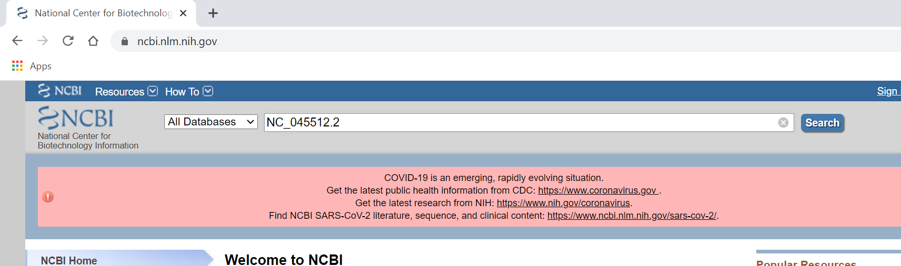
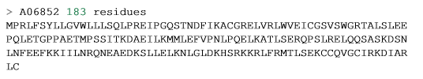
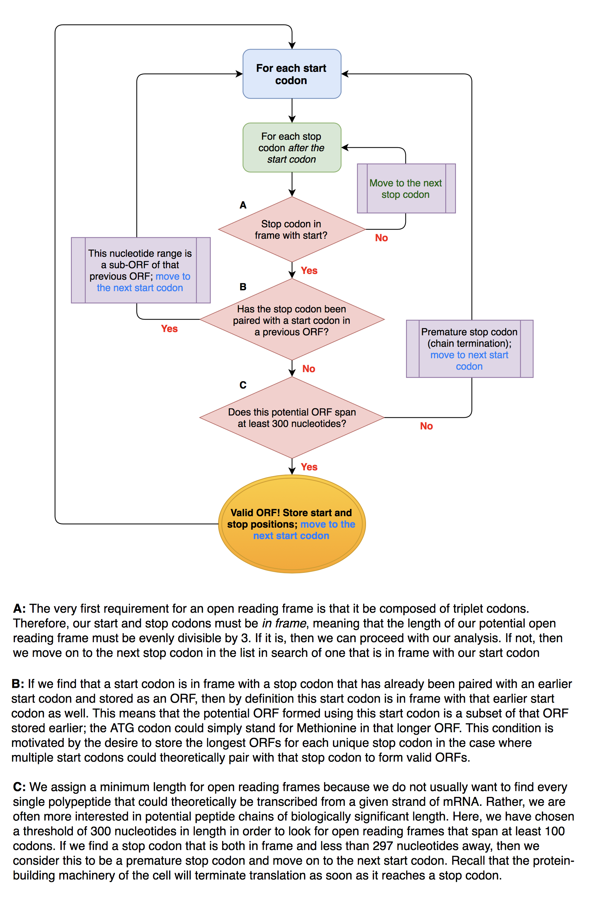
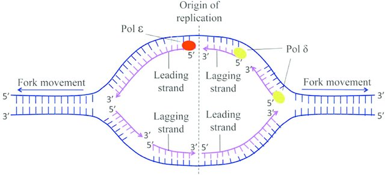

<span style="color:purple">
**Assignment objectives:** <br>
  1. Learn about NCBI sequence datatype <br>
  2. Write a function to find Open Reading Frames (ORFs) of a given DNA sequence <br>
  3. Find the origion of replication (*oriC*) of a given DNA molecule <br> 
  \span

<span style="color:red"> For your work in this assignment, please add your answers to the file entitled 'Ans3_LastnameFirstname.Rmd' and change the file name to have *your actual* first and last name. The answers are formatted to be in blue and all questions are in green, in both this document and in the answers document. Upload your answers file as an .Rmd and .html to Canvas by 11:59 p.m. the Friday of next week. \span  

<span style="color:purple"> This week's assignment has been adopted from A Little Book of R for Bioinformatics, written by Avril Coghlan; Prof. Kondrashov's labs from 2015's BIOS 10602; and Bioinformatics Algorithms An Active Learning Approach book, written by Phillip Compeau & Pavel Pevzner. \span  

R can be a powerful tool to carry out analyses common in bioinformatics. Some well known bioinformatics packages for R are the Bioconductor set of R packages ([www.bioconductor.org](www.bioconductor.org)), which contains several packages with many R functions for analyzing biological data sets such as microarray data; and the SeqinR package ([pbil.univlyon1.fr/software/seqinr/home.php?lang=eng](pbil.univlyon1.fr/software/seqinr/home.php?lang=eng)), which contains R functions for
obtaining sequences from DNA and protein sequence databases, and for analyzing DNA and protein sequences.  

For this assignment we're going to focus on computational analysis of biological sequence data such as genome sequences. Many authors have written specialized packages for R that don't come with the standard R installation. We need to install and load the SeqinR package before we can use it. Execute the commands:

```{r}
install.packages('seqinr', repos='http://cran.us.r-project.org')

#use either "library("seqinr")" or "require("seqinr")" to load the newly installed package onto R.
```

## Part 1: The NCBI Sequence Database

The National Center for Biotechnology Information (NCBI) maintains a huge database of all the DNA and protein sequence data that has been collected. Each sequence in the NCBI database is stored in a separate record and is assigned a unique identifier called an **accession number** that can be used to refer to that sequence record. You can easily retrieve DNA or protein sequence data from the NCBI Sequence Database via its website: [www.ncbi.nlm.nih.gov](www.ncbi.nlm.nih.gov). The NCBI accession code for severe acute respiratory symdrome coronavirus 2 (SARS-CoV-2) is NC_045512.2. Go to the NCBI website, type "NC_045512.2" in the search box, and press the "Search" button.  


 
There are many databases on the NCBI website. On the results page you will see the number of hits for "NC_045512.2" in each of the NCBI databases on the NCBI website.  For example, the PubMed database contains abstracts from scientific papers, the Nucleotide database contains DNA and RNA sequence data, the Protein database contains protein sequence data, and so on. We are looking for the RNA genome sequence of SARS-CoV-2, so click on the Nucleotide database.

When you click on the icon for the NCBI Nucleotide database, it will bring you to the record for NC_045512.2:  


In order to analyze the SARS-CoV-2 genome sequence in R, we need to download the sequence in a **FASTA** format. The FASTA format is a simple format for storing biological (DNA, RNA, and protein) sequences. It begins with a single-line description starting with a ">" character followed by lines of sequences. Here is an example of a FASTA file for a protein sequence:



To access the RNA sequence for SARS-CoV-2 from the Nucleotide database as a FASTA format sequence file, click on the "Send" at the top right of the NC_045512.2 sequence record webpage, choose "File" in the pop-up menu that appears, and then choose FASTA from the "Format" menu. Click "Create file". Name it sarscov2.fasta.
 
##Interface with NCBI in R
One can also carry out searches directly from R using the SeqinR package. The SeqinR package was written by the same group that crated the ACNUC database in Lyon, France. The ACNUC database brings together data from various sources from NCBI, UniProt, and Ensembl, and makes them all very easy to search. For a complete list of all the databases included in the SeqinR package, we can use the `choosebank()` command:

```{r, eval=FALSE}
require("seqinr") #load SeqinR library
choosebank(timeout=20)
```

We just saw all of the databases that we can search with SeqinR. Here are three of the most important ones:  

- "genebank" contains DNA and RNA sequences from the NCBI Sequence Database, except for certain classes of sequences such as draft genome sequence data from genome sequencing projects.  
- "refseq" contains DNA and RNA sequences from the curated part of the NCBI Sequence Database.  
- "refseqViruses" contains DNA, RNA, and protein sequences from viruses from RefSeq.  

If there is a particular database we want to search, we simply name that database in the `choosebank()` function. For example, if we wanted to query the Genbank database, we would say:  	
```{r}
#choosebank("genbank")
```

After we are finished with all of the analysis for a sequence, if we want to switch to another database to search, first we need to close our current database:	
```{r}
#closebank()
```

Once we specify which database to search through, we have to tell R what to look for. Luckily, the query() function is flexible, and we can specify a variety of different parameters in our search. For example, if we don't know the accession number, we can provide the name of the organism we're interested in instead. Here is a list of some of the arguments we can supply query():

| Argument | Example | Restricts your search to sequences: |
|----------|---------|-------------------------------------|
|"AC="|"AC=NC_001477"|To the given accession number|
|"SP="|"SP=Chlamydia"|To the specified organism|
|"M="|"M=mRNA"|To a specific type (eg mRNA)|
|"J="|"J=Nature"|Described in a specific journal|
|"R="|"R=Nature/460/352"|Described in a paper in a particular journal, volume, and start page|
|"AU="|"AU=Smith"|Described in a paper or submitted to NCBI by a specified author|

We can combine these arguments with logical operators. Say we wanted to find sequences published in the Nature journal by the author Smith. We would combine the arguments like: "J=Nature AND AU=Smith". Other important operators include OR and NOT. For more information, consult the documentation page for the `query()` function. Say we wanted to find the rabies genome sequence but we didn't know the accession number. Since it's a virus, we would want to search "refseqViruses" database, so we would type the commands:  

```{r, eval=FALSE}
choosebank("refseqViruses")
rabies <- query("SP=Rabies Virus")
```

The results of our search are stored under the list variable rabies. The query function gives us a list with six elements. To see what these objects are named, type:

```{r, eval = F}
attributes(rabies)
```

The content of each of these names is explained in the documentation page of the `query()` function. For example, "nelem" contains the number of sequences that match the query and "req" contains their accession numbers.   
```{r, eval = F}
rabies$nelem[[1]]
```

```{r, eval = F}
rabies$req[[1]]
```

The final step to retrieve a genomic sequence is to use the `getSequence()` function to tell R to retrieve the sequence data. Unlike the `query()` command, we need to know the accession number. To get the sequence of rabies:

```{r, eval=FALSE}
rabies_seq <- getSequence(rabies$req[[1]])
closebank() #closes session
```

<span style="color:green"> 2.1 (a) Search the Genbank database for all human (*Homo sapiens*) tRNA gene sequences. How many sequences match this query? \span

<span style="color:green"> (b) Pick any of these matches and save the gene sequence as the variable tRNA_seq. Find the length and GC content of the sequence. \span


<span style="color:green"> 2.2 It is important that you know how to find biological data, such as sequences. Doing that, as you saw in assignment, involves accessing a database. But there are many databases with different information, and different databases might handle their entries differently, or be more specialized. What is the difference between NCBI's RefSeq, UniProt, Swiss-Prot and TrEMBL?  \span  

Now that you know how to use R to pull genetic data, let's practice making functions to analyze genetic sequences.

## Part 2: Open Reading Frames
From our knowledge of the translation of mRNA into polypeptide chains, we know that the coding regions of nucleotide sequences begin with a start codon and end with a stop codon. There is one start codon (ATG in DNA code), and three stop codons (TAA, TAG, TGA). We will be implementing an algorithm to find all ORFs with some minimum length in a given nucleotide sequence below, so in support of this endeavor, we will write a few helper functions now.

<span style="color:green"> 2.1 Write a function `isStartCodon()` that takes in a codon in the form of a 3-element character vector and returns a boolean value of TRUE if the codon is a start codon and FALSE if not. (HINT: the == operator can only be used to check if two *values* are equal. If you want to check equality between vectors, you can either write a logical expression with multiple == operators, or you can go on google to find a function that will do it for you.) </span>

<span style="color:green"> 2.2 Write a similar function `isStopCodon()` that returns whether the given codon is a stop codon or not. </span>

The structure of an open reading frame is as follows: a start codon, some number of intervening codons that code for the amino acids of the protein, and a stop codon to terminate the sequence. But there is a problem. There are three different "frames" possible for a given direction. To explain:

Consider the sequence "GTCATGAT". If we start from the first nucleotide "G" and start assigning codons, then we get the following: **(frame 1) GTC ATG, or Valine Methionine**. Let's start at the second nucleotide: **(frame 2) TCA TGA, or Serine STOP**. And if we start at nucleotide 3: **(frame 3) CAT GAT, or Histidine Aspartate**. Note that if we start at the fourth nucleotide, we are ***in reading frame 1 once again***: ATG. All of this also applies to the complementary strand, so for a double-stranded genome, there are six possible reading frames.

From this, we can see that if we want our open readng frames to begin with our start codon (ATG) and end with one of our stop codons (TAA, TAG, or TGA), then we will need our start and stop codons to be **in the same reading frame**. Put simply, this means that the length spanned by our open reading frame (first nucleotide of start codon to final nucleotide of our stop codon) must be evenly divisible by 3.

Now we're getting somewhere. Another condition is the ability to store the longest ORFs for each unique stop codon in the case where multiple start codons could theoretically pair with that stop codon to form valid ORFs. A final condition is that our ORFs **must be of some minimum length with no intervening in-frame stop codons.** This means that our ORFs must code for a certain number of amino acids so that the product will be a polypeptide of significant length. If there is a stop codon in-frame between our chosen start and stop codons, then that ORF would terminate by definition at that intervening stop codon, so our putative ORF is not valid.

To summarize, our general strategy is delineated below:

1) Beginning at the first nucleotide in the sequence (i.e. in reading frame 1), move along one codon (3 nucleotides) at a time until you encounter a start codon.
    a) Once you have found a start codon, begin building your potential ORF by checking subsequent codons to see whether a stop codon follows. Make sure to keep track of how many codons are in this potential ORF.
        i) If you find a stop codon, then check to see if your potential ORF meets the minimum length requirement. If it does, then store the nucleotide range from the first nucleotide of the start codon to the final nucleotide of the stop codon.
        ii) Resume your search for start codons at the codon after this stop codon.
2) Repeat this search for reading frames 2 and 3 (i.e. beginning at nucleotides 2 and 3).



<span style="color:green"> 2.3 Write a function to find possible open reading frames (ORFs) in a given sequence. Let us define those to be a substring starting with the start codon "AUG" and ending with one of the stop codons and whose length is divisible by 3 so it can be a coding sequence without any intervening in-frame stop codons. Also, store the longest ORFs for each unique stop codon in the case where multiple start codons could theoretically pair with that stop codon to form valid ORFs. The inputs should be a nucleotide sequence and a minimum length in codons, and the output should be a character vector containing strings of the following format (see `?paste`): `"<first base of start> to <last base of stop>"` (i.e. `"409 to 1273"`). A pseudocode sketch of a possible code implementation is below: \span

```{r eval = FALSE}
###  REMEMBER to remove eval = FALSE from the code chunk header when you write your own function
findORF <- function(sequence, minLength) {
    ORFs <- character()
    for each reading frame {
        while indexStart is less than minLength * 3 nucleotides away from the end of the sequence {
            if(isStartCodon(the codon beginning at indexStart)) {
                numCodons <- 2 #for the start codon and the first codon considered in the following iteration
                for(indexStop in subsequent codons) {
                    if(isStopCodon(codon beginning at indexStop)) {
                        if(numCodons >= minLength) {
                            store ORF
                        }
                        set indexStart to indexStop so the search will continue after this stop codon
                        break
                    }
                    increment numCodons
                }
            }
            increment indexStart
        }
    }
    return(ORFs)
}
```

`break` statements are used inside a loop to basically break out of it. It does not return a value; it stops the iterations and transfers the control of the loop to outside of the loop. In a nested loop, the statement exits from the inner-most loop to the first statement outside. 


<span style="color:green"> 2.4 Use `findORF()` from above to find the ORFS in the forward and reverse strands of the HIV-1 genome given in 'HIV.fasta'. Compare the number of ORFs you find to the number of genes known to be encoded by the HIV genome (Hint: use google). Propose a reason for how there are more transcribed genes than the number of ORFs you obtained. (You will need to load in HIV.fasta into R using `read.fasta()` from `library(seqinr)`. \span

<span style="color:green">2.5. Use the function you wrote above to calculate the possible ORFs in the Zika virus genome. Note: You will need to load the genome (stored in 'zika.fasta')  \span

<span style="color:green">2.6. Do you find the number of ORFs surprising? Do some research into how the Zika genome is expressed (you may find (this page)[http://viralzone.expasy.org/6756?outline=all_by_species] useful). With this information in mind, justify the number of ORFs you found in question 2.5. \span

<span style="color:green">2.7. Use the function you wrote above to calculate the possible ORFs in the Covid virus genome. Does the nubmer of ORFs you calculated matches the number proteins proteins produced by the Covid virus. Explain your answer.

## Part 3: Finding *oriC*

The next question tries to use the tools you have learned and developed to try to address the question: Where is the origin of DNA replication?

<span style="color:blue"> Watch the DNA replication video in the lab folder. \span

We will try to do this in the bacterial genome, which usually has only one chromosome. The bacterial genome, different from that of animals, plants, fungi and archaea, is usually circular. This slightly complicates its analysis, since there isn't a point where it starts or ends, and it isn't easy to handle circular data. Hence, we are going to handle bacterial genomes as DNA sequences, as if the circular genome had been cut at an arbitrary point. Replication is fundamental for the maintenance of life, and hence, finding the point where it starts in the genome might be key to understanding certain life processes. DNA replication is performed by enzymes called DNA polymerases. They do this by first binding to specific regions of DNA, then splitting the two strands of DNA and finally creating new strands, one for each of the original strands. This way, DNA replication is semi-conservative. Our question is then, where does replication start? We will call the region where replication starts as **oriC**. There are ways of finding *oriC* experimentally, but these methods are much slower. If we can find, using computational methods, a way of suggesting some regions where *oriC* could be, even though not giving the exact region, we might help a lot in speeding up these experimental approaches.  

 

One approach to finding *oriC* would be to try to find some words in the bacterial genome that indicate that region as where replication starts. This could be done statistically, by finding unusually frequent words (in the sense that it is more frequent in the DNA genome than in a randomly generated sequence of the letters "A", "G", "C" and "T" of the same length) clumping together within short regions of the genome. We are going to instead use an approach based on the content of guanine and the content of cytosine in the genome, by using a sliding window approach.  

But why should the frequencies of G and C help settle this question? This was hinted at in the lab. It turns out that replication generates mutational anomalies due to the asymmetry of replication. This is because DNA polymerase is *unidirectional*, it can only transverse DNA in the reverse direction (from 3' to 5'). This causes no problem for the reverse half-strand, but the forward half-strand, which is unraveled for replication from 5' to 3', can't be replicated from the start; it must wait until there is enough space for the DNA polymerase (these enzymes are huge biological machines, and need a fair amount of space before binding) to bind a few nucleotides down the road and then be able to replicate the short segment that was unraveled thus far in the direction 3'-> 5'.
These generates several phenomena in DNA, such as the famous Okazaki fragments. What is relevant to us though, is that, because of this, the forward half-strand spends much more time single stranded than the reverse half-strand. And single-stranded DNA has much higher mutation rates than double-stranded DNA! <span style="color:red"> **Specifically, C tends to mutate into T by a process called deamination** \span. 

The rate of deamination in single-stranded DNA is 100 times higher than in double-stranded DNA. This creates mismatched pairs T-G which are then corrected in the next replication into T-A pairs. It should be the case then, that in the forward half-strand the C content should be low in relation to the G content, and the opposite behavior in the reverse half-strand (because the forward half-strand of the complementary strand pairs with the reverse half-strand of the original strand). In particular, `G_content(genome)-C_content(genome)`, for some genome, should be smallest close to the *oriC*, since *oriC* is the point that separates the beginning of the reverse half-strand and the end of the forward half-strand. 

<span style="color:green"> 3.1 With all of this said, let's analyze the most studied bacterial genome: *E. Coli*. \span

<span style="color:green"> (a) Put the *E. coli*, *Thermotoga petrophila* and *Sulfolobus solfataricus* in your working directory. The following code loads all of these files into R. \span  

```{r}
#e_coli <- read.fasta("E. coli.fasta")[[1]]
#t_petrophila <- read.fasta("Thermotoga petrophila.fasta")[[1]]
#s_solfataricus <- read.fasta("Sulfolobus solfataricus.fasta")[[1]]
```

<span style="color:green"> (b) What we will do is try to find the point where the difference between the G content and the C content achieves a minimum. For that, write a function called `skew()` that receives as input a vector of characters aka a DNA sequence (which in our case will be in fact a whole bacterial genome) and a positive integer i and outputs the difference between the G count and the C count from the first nucleotide in the DNA sequence up to nucleotide number i (for i = 0, define the skew to be 0).  \span  

<span style="color:green"> (c) Now, write a function called `skewDiagram()` that, given a DNA sequence, outputs the skew diagram of the DNA sequence. A skew diagram is a plot that has on the x axis positive integers (with x ranging from 0 to the length of the DNA sequence), and on the y axis the skew of the DNA sequence up to the index x. Hint: This is the first time in this course you are going to face genomical analysis. One of its challenges is that genomes are huge. Even a bacterial genome might be non-trivial to a personal computer. Therefore, your implementation of the algorithm might affect a lot the time you spend in this assignment. Think carefully on how to implement your function. First of all, do not recount G and C every time you need to compute some skew. Instead, find a way of just updating previous skews. (**NOTE: to make this execute in << tens of minutes, plot `skew[seq(1, length(skew), 10000)]` vs. `seq(1, length(skew), 10000)`) Be sure to ask to your TA for help if needed. Below is some pseudocode to get you started. Note that the code is for both part b and c.\span 

```{r,eval=FALSE}
#PART B
exDNA<- c("c","t","a","t","g","g","c","g","g","g","t","a") #example short DNA sequence to work on 
skew <- function(v){
  skewveca <-  #make empty vector that's the length of your DNA sequence
#before anything, you need to establish what skewveca[1] is based on what the first base of your DNA sequence
  if(v[1]=="g"){  #if it's g, start at 1
    skewveca[1] <- 1 
  #if v[1] == c, start at -1
  #if v[1] == a or t, start 0
    
  for(a in 2:length(v)){ #from base 2 forward, add a 1 if it's a "g", -1 if it's a "c", +0 if it's "a" or "t"
    #if(...){}
  return(skewveca)
}

#PART C

#second function to plot our skew vector
#be sure to plot ONLY EVERY 10,000TH VALUE IN YOUR SKEW VECTOR 
  #hint: use seq()
skewdiagram <- function(v){
  #plot()
  return()
}
skewdiagram(b_subtilis)
```


<span style="color:green"> (d) Write a function `min_skew` that, given a DNA sequence, finds the i such that `skew(DNA, i)` is the minimum among possible i. \span  

<span style="color:green"> (e) Now, use the functions you just wrote to analyze the genome of *E. coli*. Given the skew diagram of *E. coli*, report **and justify** where you expect *oriC* to be located in the *E. coli* genome (notice that the minimum may differ from *oriC* due to random fluctuations in the G or C frequencies, hence, you should really indicate a short region rather than a point). (Hint: your suggested region should be a span 500 to 1000 nucleotides long) \span

<span style="color:green"> 3.2 Now, load the genome of *Thermotoga petrophila* and plot its skew diagram. How is this different from that of *E. coli*? Where would you expect the *oriC* of *Thermotoga petrophila* to be? \span

<span style="color:green"> 3.3 Load the genome of the archea *Sulfolobus solfataricus* and plot its skew diagram. We've seen that the minimum skew provides a guess for the *oriC* of bacterial genome. Notice though, that we were focusing on global minima. You can see on the skew diagram of *Sulfolobus solfataricus* that there are three clear valleys were you can identify local minima. What might this indicate? Try to find published experimental evidence that proves your hypothesis. \span