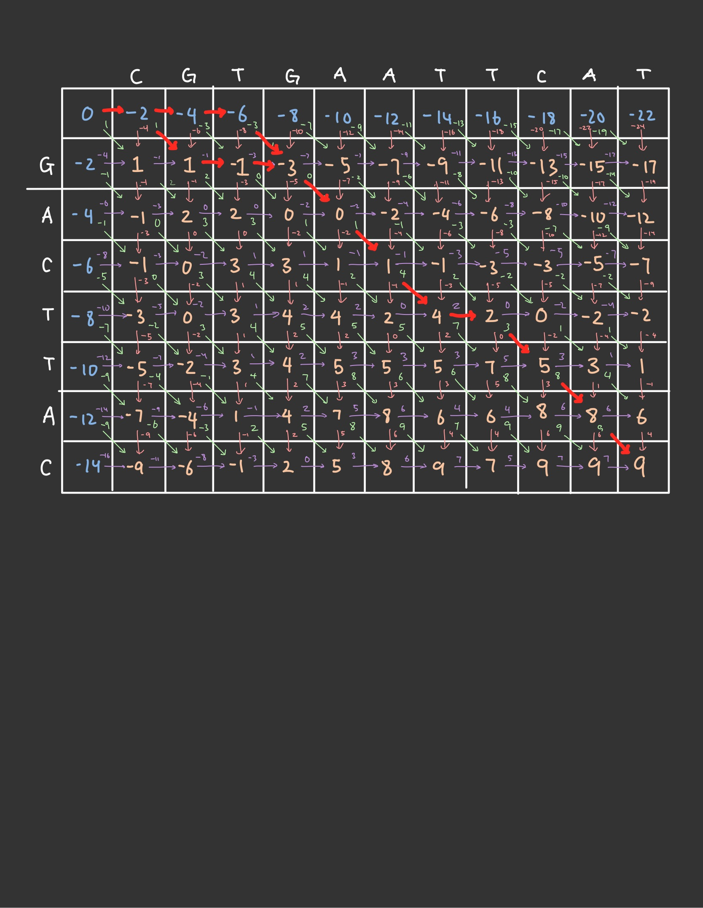

## Computer Assignment 4 Answers File
---
Please write your answers into the space below the questions. Knit this file when you are done to check that all code runs. Remember to rename the file to contain *your actual* Last and First name.
---

```{r setup}
library(seqinr)
library(tidyverse)
if (!requireNamespace("BiocManager", quietly = TRUE))
    install.packages("BiocManager")
BiocManager::install("Biostrings")
suppressMessages(library(Biostrings)) #silently loads Biostrings functions
source("pairAlign_cpp.R")
```


<span style="color:green"> 1.1 \span
<span style="color:blue">  Suppose we have an m (cols) by n (rows) matrix. The number of inputs we need to fill this matrix in is actually m-times-n. Then, the question is once we give it m-times-n inputs, how does it fill this rectangle of values? It could it either fill it in row by row, or column by column. The byrow argument, when set to true, tells R that we want to fill the matrix by row, meaning first take the first m values, and put it in the first, row. Then take the next m values and put it in the second row, all the way to the nth row. Setting it to false means we want to fill it by column (which is default)\span

<span style="color:green"> 1.2 \span
<span style="color:blue"> R does its best to make sense of the input we give it when the number of elements we get it does not necesarily matches the size of the matrix. When we give it too little inputs, R has to make sure that the input size is a sub-multiple of the number of elements in each column (assuming we fill by column). What this means is that if we each column contains 4 elements, we need to fill it with some data that is a multiple of 4. What it will do is that if for instance we give it an input of 8 elements then, it will repeatedly fill those 8 elements until the matrix is full. What this means is that it is also case that the number of inptus we give it, when reduced to how many columns it can fill, will also need to be a submultiple of the number of columns. In order words, since, we have given it an input of 8 elements (which will be 2 columns), our matrix should have a multiple of 2 columns like 4 or 6. If for instance it is 7, R will complain again. As it relates giving too many inputs, R again cares that the number of elements we give it is divisible by the number of rows there are so that it knows that it would be able to fill each column.\span


<span style="color:green"> 1.3 \span
```{r}
test_matrix <- matrix(data = 1:25, nrow = 5, ncol = 5)
test_matrix
cat("mean():", mean(test_matrix), "\n")
cat("sum():", sum(test_matrix), "\n")
cat("sd():", sd(test_matrix), "\n")
```
<span style="color:blue"> R performs these fucntion onto ALL the elements of the matrix. If we want to implement these functions onto columsn or rows, we would have to specify. \span


<span style="color:green"> 1.4 \span
```{r}
another_matrix <- matrix(data = 1:6, ncol = 3, nrow = 2)
another_matrix
dim(another_matrix)
```
<span style="color:blue"> dim() first tells us how many rows there are, there tells us how many columns there are. \span

<span style="color:green"> 1.5 \span
```{r}
test_matrix2 <- matrix(data = 1:9, ncol = 3, nrow = 3)
for (i in 1:nrow(test_matrix2)) {
  for (j in 1:ncol(test_matrix2)) {
    test_matrix2[i, j] = 0
  }
}

test_matrix2
```


<span style="color:green"> 1.6 \span
```{r}
x <- matrix(nrow = 3, ncol = 3, data = 1:9)
x
for(i in 1:ncol(x)) {
  for(j in 1:nrow(x)) {
    print(x[i,j])
  }
}
```
<span style="color:blue"> The above code actually is conceptually wrong in that i loops over the columns, but is used in the row index, and j loops over the rows, but is  used in the col index. However, since ncol and nrow is the same size, it still works. However, strictly speaking the for loop is looping through the rows, and then for each row it prints out each column element in that row. \span


<span style="color:green"> 1.7 \span
```{r}
rowSD <- function(M) {
  SDs <- rep(NA, nrow(M))
  for (row_i in 1:nrow(M)) {
    SDs[row_i] <- sd(M[row_i,])
  }
  
  return(SDs)
}

rowSD(x)
```


<span style="color:green"> 1.8 \span
```{r}
x %*% x
```
<span style="color:blue"> Here, where we add the percentage signs on each side of the multiplication sign, the operation becomes that of actual matrix multiplication, in which each row of the first matrix is muliplied by each column of the second matrix and added together and placed as an entry in the resulting matrix.\span


<span style="color:green"> 2.1 \span
<span style="color:blue"> 
<li>a: 14 (5 match, 1 mismatch, 1 gap)</li>
<li>b: 6 (4 match, 0 mistmach, 3 gap)</li>
<li>c: 7 (4 match, 1 mistmatch, 3 gap)</li>
\span


<span style="color:green"> 2.2 \span
<span style="color:blue"> When we use the strsplit function, we return a list of strings that were split via the seperation argument (which in our case was ""), so it basically just split the string character by character, and returns a list of those characters.\span

```{r}

# create our look up table
lut <- matrix(1, 4, 4)
diag(lut) <- 3
dimnames(lut) <- list(c("A", "C", "G", "T"), c("A", "C", "G", "T"))
lut
```


<span style="color:green"> 2.3 \span
<span style="color:blue">  \span

<span style="color:green"> 2.4 \span
```{r}
alignmentMatrix<-function(seq1,seq2, scoreMat){
  #convert seq1 and seq2 strings to vector
  seq1 <- strsplit(seq1, "")[[1]]
  seq2 <- strsplit(seq2, "")[[1]]
  
  amatrix<- matrix(0, ncol=length(seq1)+1, nrow=length(seq2)+1) #initialize alignment matrix
  rownames(amatrix) <-c("", seq2) #set row names
  colnames(amatrix) <-c("", seq1) #set column names
  
  # set values of the first row and column:
  for (i in 1:nrow(amatrix)) {
    amatrix[i,1] <- (-2) * (i - 1)
  }
  
  for (j in 1:ncol(amatrix)) {
    amatrix[1,j] <- (-2) * (j - 1)
  }
  
  # use max[(D + score(), U + gap, L + gap)] for the rest of the columns to determine the best score for each entry\
  gap <- -2
  for (i in 2:nrow(amatrix)) {
    for (j in 2:ncol(amatrix)) {
      U <- amatrix[i - 1, j] + gap
      L <- amatrix[i, j - 1] + gap
      D <- amatrix[i - 1, j - 1] + scoreMat[i - 1, j - 1]
      amatrix[i, j] <- max(U, L, D)
    }
  }
  
  return(amatrix)
}
```

<span style="color:blue"> \span

<span style="color:green"> 2.5 \span
```{r}
seq1 <- "CGTGAATTCAT"
seq2 <- "GACTTAC"
scoreMat <- lut[strsplit(seq2, "")[[1]], strsplit(seq1, "")[[1]]]

alignmentMatrix(seq1, seq2, scoreMat)
```

<span style="color:blue"> The optimal alignment between these sequence is 9 (the bottom right number always) \span


<span style="color:green"> 2.6 \span
<span style="color:blue"> There are only two possible potential pathways, not three, and they are as follows:
<ol>
  <li>
    <ul>
      <li>
        CGTGATTCAT
      </li>
      <li>
        _G__ACTT_AT
      </li>
    </ul>
  </li>
  <li>
    <ul>
      <li>
        CGTGATTCAT
      </li>
      <li>
        ___GACTT_AT
      </li>
    </ul>
  </li>
</ol>\span

<span style="color:green"> 2.7 \span
<span style="color:blue"> The sequences from Q2.3 was the same as the example sequences we had to use in the previous question.\span

<span style="color:green"> 2.8 \span
```{r}
sq1 <- "GATTACACCTAGGTACT"
sq2 <- "GATCCAACGTCCAA"

sub1 <- nucleotideSubstitutionMatrix(match = 2, mismatch = -1, baseOnly = TRUE) #creates DNA substitution matrix
pairAlign(sq1, sq2, substitutionMatrix = sub1, gapExtension = -2, type = "global")
```

<span style="color:green"> 2.9 \span
```{r}
sub2 <- nucleotideSubstitutionMatrix(match = 4, mismatch = -2, baseOnly = TRUE) #creates DNA substitution matrix
pairAlign(sq1, sq2, substitutionMatrix = sub2, gapExtension = -3, type = "global")
```

<span style="color:green"> 2.10 \span
<span style="color:blue"> I notice that the sequence alighment is still the same, meaning the weights of how a match compares to a mismatch or gap is not significant enough to create an impact of the actual alignement. However, the score at the end is greater, which makes sense since now a match is worth 4 points not 2 \span

<span style="color:blue"> Your answer here \span

<span style="color:green"> 2.11 \span
<span style="color:blue"> Remember that a gap requires some sort of functionality to cause that gap, and then once we go back to matching bases, that enzyme is no longer needed. If the gap is dispersed, that means that there are a lot of swtiching back and forth between gaps and matching nucleotides, which is inefficient. Having one large gap means that this switch occurs only once, which means its more likely or more favorable. \span

<span style="color:green"> 2.12 \span
```{r}
print("gapOpening: 0, gapExtension: 0\n")
pairAlign("MVWHDVD", "HDVGVWGHDD", substitutionMatrix="BLOSUM62", gapOpening = 0, gapExtension = 0, type = "global")

print("gapOpening: 0, gapExtension: -2\n")
pairAlign("MVWHDVD", "HDVGVWGHDD", substitutionMatrix="BLOSUM62", gapOpening = 0, gapExtension = -2, type = "global")

print("gapOpening: -8, gapExtension: -2\n")
pairAlign("MVWHDVD", "HDVGVWGHDD", substitutionMatrix="BLOSUM62", gapOpening = -8, gapExtension = -2, type = "global")
```
<span style="color:blue"> If we look at the comparison between the first one (open and extension 0 and 0) versus the second one (open and extension 0 and -2), we do not see any different in the actual alignment (most likely because the numbers are not significant enough to influence a chance), but we do see that the score is different which makes sense for the literal fact that the scoring number for gaps is different. If we compare the 1st and 2nd to the 3rd however, we do see a difference in the alignment. Notably, in the 3rd one, we see a triple gap in sequence. What this suggests is that because we added a much greater penality for open gaps, in comparison to closing gaps, we made the alignment a lot more inclined to make sure that  the alignment has as little open gaps as possible, which explains the different we see. \span

<span style="color:green"> 3.1 \span
```{r}
source("ORF.R")
ecoli <- seqinr::read.fasta("E_coli.fasta")[[1]]
E_coli_ORF <- findORF(ecoli, 300)
```

<span style="color:green"> 3.2 \span
```{r}
E_coli_ORF <- E_coli_ORF[order(E_coli_ORF$Length, decreasing=TRUE), ]
```

<span style="color:green"> 3.3a \span
```{r}
head(E_coli_ORF)
```


<span style="color:green"> 3.3b \span
<span style="color:blue"> I chose the gene located from 337 to 2799 (frame 1). This part of the gene is responsible for Aspartate kinase I / homoserine dehydrogenase I (ThrA), an enyzme that catalyzes the first step in the biosynthesis of lysine and homoserine.\span


<span style="color:green"> 3.4 \span
```{r}
L_plantarum <- seqinr::read.fasta("L_plantarum.fasta")[[1]]
L_plantarum_ORF_300 <- findORF(L_plantarum, 300)
L_plantarum_comp_ORF_300 <- findORF(compStrand(L_plantarum), 300)
nrow(L_plantarum_ORF_300)
head(L_plantarum_ORF_300)
nrow(L_plantarum_comp_ORF_300)
head(L_plantarum_comp_ORF_300)
```

span style="color:green"> 3.5a \span
```{r}
L_plantarum_ORF_75 <- findORF(L_plantarum, 75)
L_plantarum_comp_ORF_75 <- findORF(compStrand(L_plantarum), 75)
nrow(L_plantarum_ORF_75)
head(L_plantarum_ORF_75)
nrow(L_plantarum_comp_ORF_75)
head(L_plantarum_comp_ORF_75)
```


span style="color:green"> 3.5b \span
```{r}
Staphylococcus <- seqinr::read.fasta("Staphylococcus-sequence.fasta.txt")[[1]]
Staphylococcus_ORF <- findORF(Staphylococcus, 75)
Staphylococcus_comp_ORF <- findORF(compStrand(Staphylococcus), 75)
nrow(Staphylococcus_ORF)
nrow(Staphylococcus_comp_ORF)
```
span style="color:blue"> one thing I noticed is that the number of different encoding regions, when we include both the forward and reverse strand, is about 3000, but which is slightly greater than the number of proteins we know it to encode for which is ~2800. Some possible explanations for this is that some gene regions actually code for the same protein, or that there are similar genes in one region of the forward strand to one region of the reverse strand.\span

span style="color:green"> Suprisingly, when I go to the NCBI website and calculate the ORF there, I get a much smaller number (450 ORFs), and so no it does not match the bumber of proteins either. \span
