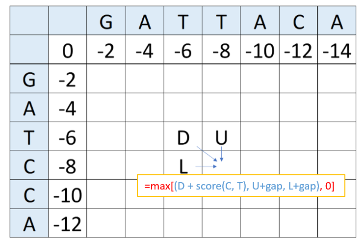
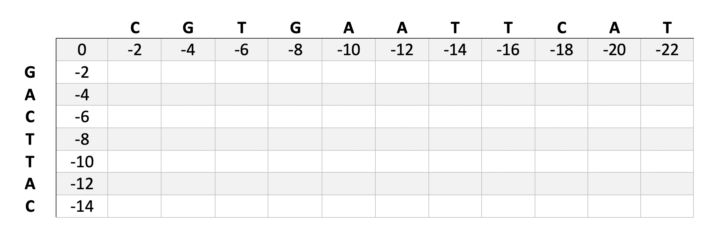
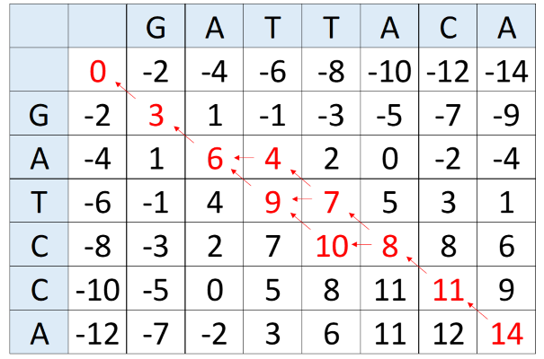

```{r setup, include=FALSE}
knitr::opts_chunk$set(comment = "")
```

<span style="color:purple">
**Assignment goals:** <br>
**1. Understand the application and implementation of sequence alignment** <br>
**2. Learn how to use matrices** <br>
**3. Implement the Needleman-Wunsch algorithm to find the optimal global alignment between two sequences**
\span

<span style="color:red"> For this assignment, please provide blue responses to all questions in green. Please upload a knitted html file and an Rmd titled "Ans4LastnameFirstname.html" to Canvas by 11:59pm CST the Friday after discussion.\span

**Sequence alignment** refers to the process of arranging different protein or nucleic acid sequences relative to one another to identify regions of similarity. Alignment is used to assess the evolutionary relatedness of sequences and highlight regions of potential functional or structural importance. Sequence alignment algorithms are leveraged in numerous biological applications, including phylogenetic analysis; gene functional prediction; genome assembly; transcriptome analysis; detection of single nucleotide polymorphisms (SNPs); protein structural prediction; and many other applications in molecular evolution and molecular biology.  

For a brief example of the process of sequence alignment, take the following two protein sequences. It is clear that they contain many identical amino acids across the length of the sequence. However, since the sequences are of different lengths, a direct superimposition of amino acid positions only uncovers three identical amino acids (colored in red):  

<span style="color:red">L E V<span style="color:black"> T K G G Q R K D R R  \span    

<span style="color:red">L E V<span style="color:black"> G M T K G G Q R K E R R  \span  

Clearly, this direct comparison is not the best way to assess the relatedness of these two sequences. As humans capable of abstract reasoning, we can quickly see that it appears that these two sequences actually differ in one fundamental way: one sequence underwent an insertion (or a deletion, depending on the polarity of the change) event that did not occur in the other. Therefore, we can indicate the presence of a two nucleotide **gap** (represented by the "- -") in the shorter sequence to increase the number of pairwise identities in these sequences:  

<span style="color:red">L E V <span style="color:black">- -<span style="color:red"> T K G G Q R K<span style="color:black"> D<span style="color:red"> R R\span  

<span style="color:red">L E V<span style="color:black"> G M<span style="color:red"> T K G G Q R K<span style="color:black"> E<span style="color:red"> R R\span  


It is apparent that these two sequences are likely related to each other evolutionarily--that is, they share many amino acid identities due to the presence of a common ancestor with the same amino acid pattern. <span style="color:purple"> **Evolutionary convergence by random chance to a 15-amino acid sequence with 80% identity is an extremely unlikely scenario,** and thus we conclude that these two sequences are related. Furthermore, based on the distribution of amino acid states, we can infer the sequence attributes of this peptide that are important. For example, if we believe that both protein sequences fulfill a similar biological function, we can conclude that the 'GM' motif in the second protein is not essential for this function. Similarly, we can conclude that at position 13 in the alignment, while strict conservation is not necessary, a negatively charged amino acid side chain might be functionally important. \span

In this toy scenario, we were able to derive the optimal alignment by eye. However, the relationships between real sequences are rarely so straightforward. As such, many computational approaches have been devised for determining the optimal alignments between protein or nucleic acid sequences. In this assignment, we will learn the basic algorithm for **global pairwise sequence alignment**, which seeks to determine the optimal mapping between two sequences. Next week, we will introduce the **local pairwise sequence alignment** and **multiple sequence alignment**.

## Part 1: Refresher on Matrices 

A matrix is very similar to a data frame, except that all elements in a matrix have to be of the same type. In other words, matrices are very similar to vectors. There are many situations in which a vector is not sufficient to hold all of our data of interest.

Matrices can be created in the following way:

```{r comment = ''}
matrix(data = 1:4, nrow = 2, ncol = 2)
```

As you may have guessed, the `nrow` and `ncol` arguments dictate how many rows and columns there are in the matrix. The data argument takes a vector, and subsequently populates the elements of the matrix with the values in the vector. In R's matrix command there is a default argument `byrow`, which by default is set to `FALSE`. However, this can be overridden by the following:

```{r comment = ''}
matrix(data = 1:4, nrow = 2, ncol = 2, byrow =TRUE)
```

<span style="color:green"> 1.1.	Compare the two matrices and explain the difference. What is the `byrow` argument doing?</span>

Above we specified a vector that was conveniently the same size as the number of elements in our matrix.

<span style="color:green"> 1.2.	What happens when the vector we supply to the data argument contains MORE elements than the matrix does? How about when the vector contains FEWER elements? Provide example matrices where the argument size does not match the matrix dimension, and explain how R handles them. \span

Like vectors, matrices can be used with a lot of R's built-in functions. Create the following matrix.

```{r comment = ''}
x <- matrix(data = 1:25, nrow = 5, ncol = 5)
x
```

If we use the built-in R function `rowMeans()`, we can obtain the mean of each row of data in our matrix (returned as a vector).

```{r comment = ''}
rowMeans(x)
```

Similarly, the built-in function `colMeans()` will get us the means of each of the columns:

```{r comment = ''}
colMeans(x)
```

<span style="color:green">1.3.	Try using some of the built-in functions you already know on this matrix (i.e. `mean()`, `sd()`, `sum()`, etc.). How is R performing these calculations (is it by row, by column, or all elements in the matrix?)</span>

Like we did for vectors, we could use `length()` to determine the number of elements in the matrix. However, this doesn't help us if we want to know the number of rows or the number of columns. Thankfully, there are built-in functions to help us with that also: `ncol()` and `nrow()`

```{r comment = ''}
ncol(x)
nrow(x)
```

If we want to know the overall dimensions of the matrix, we can use the built-in function `dim()`, which will return a vector.

```{r comment = ''}
dim(x)
```

<span style="color:green">1.4. Make a matrix of your own that contains a different number of rows and columns. Which element of the vector returned by `dim()` represents the number of rows? Which represents the number of columns?</span>

We can also access individual elements of our matrix. For the following exercises, create the following matrix:

```{r comment = ''}
testMatrix <- matrix(nrow = 3, ncol = 3, data = 1:9)
testMatrix
```

Like with vectors, we access the elements of a matrix using brackets. However, this time we have to provide two values to the brackets instead of just one. But which value represents the rows and which represents the columns? **The index for the row comes first and then the index for the column.** Say we wanted to find the value in the third row and the second column; the syntax would be the following:

```{r comment = ''}
testMatrix[3, 2]
```

If we wanted to address the element in the second row of the third column:

```{r comment = ''}
testMatrix[2, 3]
```

<span style="color:green">
1.5.	Create a 3 x 3 matrix with whatever starting values you like. Then, use indexing to replace each element in that matrix with a new value. You can use a loop.</span>

If we want all values in the second row returned as a vector we simply leave the column value blank:

```{r comment = ''}
testMatrix[2,]
```

Or if we wanted all values in the second column:

```{r comment = ''}
testMatrix[, 2]
```

We can use for loops if we want to apply an arbitrary function to the rows and/or columns of a matrix and have it return a vector or matrix with the results. The following code contains a nested for loop:

```{r eval = FALSE}
x <- matrix(nrow = 3, ncol = 3, data = 1:9)
for(i in 1:ncol(x)) {
  for(j in 1:nrow(x)) {
    print(x[i,j])
  }
}
```

<span style="color:green">
1.6.  Describe how the for loops in the code above iterate over the elements in the matrix. In what order are the elements of the matrix printed? *(Hint: It might help to look at how the elements of the matrix are ordered in the output of the for loop and compare it to how the elements are arranged in the matrix.)* </span>

<span style="color:green">
1.7.	Write a function called `rowSD()` that takes a numeric matrix as its argument. Have that function calculate the standard deviation for each of the rows and return the results as a vector (you can use `sd()` within your function, and you will need to iterate over the rows of the matrix.) Test the function using `testMatrix`.</span>

Just like with vectors, if two matrices are of the same dimensions (and contain numerical data) we can perform arithmetic operations on them.

```{r comment = ''}
testMatrix + testMatrix
testMatrix * testMatrix
```

**Note that the above matrix multiplication is not true matrix multiplication.** If you are not familiar with matrix multiplication, take a look at this tutorial (<https://www.mathsisfun.com/algebra/matrix-multiplying.html>) or ask your TA for help.

<span style ="color:green">1.8. Try `testMatrix %*% testMatrix` and briefly explain the result. </span>

## Part 2: Global pairwise sequence alignment

**In a pairwise sequence alignment we seek to identify the optimal mapping between two sequences.** In particular, we might want to know whether the degree of similarity between two sequences is greater than expected by chance, implying divergence from a common ancestor via mutation and fixation. Pairwise sequence alignments come in two primary flavors: **global alignment**, which attempts to align the entire lengths of two sequences from start to finish, and **local alignment**, which attempts to uncover subsets of one or both sequences which are similar to one another. <span style="color:purple"> Global pairwise alignment is appropriate when you expect the entire sequence on hand is likely to be related through evolutionary history. Local pairwise alignment is appropriate when you expect only a portion of the sequence to be related through linear evolution. \span

Both global and local pairwise sequence alignments can be accomplished through well-established **dynamic programming algorithms**. For global alignment, we will introduce and implement the **Needleman-Wunsch algorithm**. A modification of this code give us the **Smith-Waterman algorithm** for local alignment, as we will see next week. If at any point you need help with those algorithms, check  https://en.wikipedia.org/wiki/Needleman%E2%80%93Wunsch_algorithm and  https://en.wikipedia.org/wiki/Smith%E2%80%93Waterman_algorithm.<span style="color:purple"> These dynamic programming algorithms are guaranteed to find the optimal alignment between two sequences. \span

Both of these algorithms implement similar logic. The goal is to assign a relative **score** to a particular alignment between protein or DNA sequences, with more positive scores reflecting patterns that are expected in a case of common ancestry and more negative scores attributed to patterns that are inconsistent with common ancestry. In the case of a DNA sequence alignment, **for example, a reasonable scoring system might attribute a score of +3 to a sequence match, +1 to a mismatch, and -2 to a gap.** These scores are summed across columns in the alignment.

<span style="color:green"> 2.1 Given the scoring scheme above, compute the alignment scores of the following three sequence alignments of the sequences “G A T T A C A” and “G A T C C A”.. \span

<span style="color:green">
a.  
G A T T A C A  <br>
G A T - C C A  \span   
    
<span style="color:green">
b.  
G A A T T - C  <br>
G A - T T A -  \span
    
<span style="color:green">
c.  
G A A T T A A A  <br>
G A G T - A - - \span 

    
One method for determining the optimal alignment is to enumerate every possible alignment between two sequences, calculate the scores, and pick the maximum. However, in all but the shortest alignment problems, this is computationally infeasible, as the number of possible alignments is extremely large. Instead, the Needleman-Wunsch algorithm provides a simple method for determining the maximum alignment score between two sequences and the alignment that produces this score.  

In order to implement this algorithm, we must define two matrices. First, the **score matrix** $(s_{ij})$ contains as its elements the alignment scores for all possible combinations of sequence states between our two sequences to be aligned. For our nucleotide model above, it will contain a 3 for all elements where sequences x and y are identical, and a 1 wherever the two nucleotides differ. For a protein alignment, the score matrix will adopt values from a matrix such as the **PAM matrices** (created by Margaret Dayhoff) or, more commonly, the similar **BLOSUM matrices** which scores the relative mutability of amino acids and likelihoods of transitions from one amino acid to another. (Note: thses matrices are expressed as probabilities of transition, while the equivalent alignment scores are converted to log-odds. If this means nothing to you, don’t sweat it, we will talk about them in class.)   

The second matrix is the **alignment matrix** $(F_{ij})_{n \times m}$. It is within this matrix that we will dynamically determine the optimal score of our alignment. We will build this matrix in an iterative manner given the elements of the score matrix and our gap penalty.  

To create our DNA substitution score matrix $s$, we will execute the following code in R. First, we load the *seqinr* package, which contains useful commands for sequence manipulation:

```{r eval=FALSE}
install.packages('seqinr', repos='http://cran.us.r-project.org')
```
```{r}
library(seqinr)
```

Next, we load our two sequences to be aligned:
```{r}
x <- strsplit("GATCCA", "")[[1]]
y <- strsplit("GATTACA", "")[[1]]
x
y
```

<span style="color:green"> 2.2 What is happening to the strings "GATTACA" and "GATCCA"? (hint: see ?strsplit for help if needed. strsplit() outputs a list object.) \span

#### Scoring Matrix

Now, we create our scoring matrix $s$ by filling in each element `s[i, j]`. If the nucleotides at `x[i]` and `y[j]` are identical, we want the value for `s[i,j]` to be +3. If `x[i]` and `y[j]` differ, `s[i,j]` is +1.

We could easily take a naive approach to this first part of the problem by implementing a scoring matrix algorithm as follows:

```{r}
scoreMatrix <- function(s1, s2){ #function of two sequences
    size1 <- length(s1)
    size2 <- length(s2)
    scoreMat <- matrix(0, size1, size2)
    for(i in 1:size1){
        for(j in 1:size2){
            if(s1[i] == s2[j]){
                scoreMat[i,j] <- 3
            } else {
                scoreMat[i,j] <- 1
            }
        }
    }
    dimnames(scoreMat) <- list(s1, s2)
    return(scoreMat)
}

scoreMat <- scoreMatrix(x, y)                                        
scoreMat
```

It works just fine. However, this being R, we can use some convenient wizardry that should theoretically be faster.

First, let us establish a **lookup table**. This will contain the scores for matching any nucleotide to any other nucleotide. Following our simple scoring scheme from above, we will say again that a nucleotide matched to itself will be scored as 3, and a nucleotide scored to any other nucleotide is scored as 1. For example

```{r}
lut <- matrix(1, 4, 4)
diag(lut) <- 3
dimnames(lut) <- list(c("A", "C", "G", "T"), c("A", "C", "G", "T"))
lut
```

Now we have a named matrix that we can use to look up any pairwise score between nucleotides:

```{r}
lut["G", "A"] #finds the score for matching a guanine with an adenine
```

The real magic happens when we give more than one nucleotide at once. Using indexing, we can generate the scoring matrix from above via **one indexing operation**:

```{r}
scoreMat <- lut[x, y]
scoreMat
```

<span style="color:red">As mentioned in our early assignments, indexing is indeed a powerful operation!</span>

Now that we have defined the scoring matrix $(s_{ij})$, we are ready to recursively build our alignment score matrix $F$. To say that $F$ is built recursively is to say that **the value stored in each element of the matrix is determined by the values stored in the elements *above and to the left of it***. 

In building alignment matrix $F$, we move from the upper-left corner `[0,0]`, which starts with a score of 0. We then fill our matrix starting from the top-left and ending at the bottom-right, dynamically modifying the alignment score until we reach the bottom-right corner, which contains the optimal alignment score between the two sequences. 

We *initialize* our matrix $(F_{ij})$ by moving directly across the first row and directly down the first column. This scenario corresponds to producing a perfectly gaped alignment like the following, which represents the worst possible alignment with a score of -26.  
   
   \[\begin{array}
   \text{G} & \text{A} & \text{T} & \text{T} & \text{A} & \text{C} & \text{A} & \text{-} & \text{-} & \text{-} & \text{-} & \text{-} & \text{-}\\ 
   \text{-} & \text{-} & \text{-} & \text{-} & \text{-} & \text{-} & \text{-} & \text{G} & \text{A} & \text{T} & \text{C} & \text{C} & \text{A}\end{array}\]      
   
Now, we want to move toward the bottom right corner of our matrix, filling in each matrix value iteratively by progressively extending an alignment according to the best possible move. In filling in an element `F[i, j]`, there are three choices we can make: 

1. We could align $x_i$ to $y_j$ and add the corresponding score $s[x_i, y_j]$ (contained in `s[i-1, j-1]`) to the previous alignment step, whose score is in element `F[i-1,j-1]` 
2. We could align $x_i$ to a gap, and add the gap penalty -2 to the previous alignment step, whose score is in element `F[i-1, j]`
3. We could align $y_j$ to a gap, and add the gap penalty -2 to the previous alignment step, whose score is in element `F[i, j-1]`  

The best option is to fill element `F[i,j]` with the highest of these three possible values; this will provide the best possible alignment score of the sub-alignment of $x_1$, $\ldots$, $x_n$, and $y_1$, $\ldots$, $y_m$. When $n$ and $m$ are equal to the lengths of their respective sequences, we have determined the optimal alignment score for the entire sequences. This is represented by the element at the bottom right index of our F matrix.    


<br>

The above is a visual demonstration of how to fill in the alignment matrix, in which the equation in *BLUE* is the Needleman-Wunsch Algorithm and the equation in *RED* is the Smith-Waterman Algorithm (that we will see next week).

<span style="color:green"> 2.3. Using a scoring system of +3 for a match, 1 for a mismatch, and -2 for a gap, fill in the alignment matrix below for the sequences “CGTGAATTCAT” and “GACTTAC” on a piece of paper; show the arrows for the optimal path(s) and determine the alignment between the two sequences. **give the table and the alignment to your TA.** \span



<span style="color:green"> 2.4 Now that you've gotten a hang of filling out an alignment matrix by hand, write the function `alignmentMatrix()`, that given two nucleotide sequences (as strings) and a scoring matrix outputs their alignment matrix. \span   

```{r eval=FALSE}
alignmentMatrix<-function(seq1,seq2, scoreMat){
  
  #convert seq1 and seq2 strings to vector
  
  amatrix<- matrix(0, ncol=length(seq1)+1, nrow=length(seq2)+1) #initialize alignment matrix
  rownames(amatrix) <-c("", seq2) #set row names
  colnames(amatrix) <-c("", seq1) #set column names
  
  #REPLACE INSTRUCTIONS WITH YOUR CODE 
  #            |
  #            |
  #            v
  #set the values of the 1st row and column
  #then loop through the rest of the matrix compare possible values (look at the formula in blue above)
  
  
    return(amatrix)
}
```

The Needleman-Wunsch algorithm can also tell us what specific alignment produces the maximal alignment score. To do this, we highlight the path of choices that leads to this value through a process called traceback. Remember, in filling the score for any particular cell, we had the choice of filling it from the elements to the left, above, or diagonally up and to the left. Some programming languages are capable of storing pointers, which serve to store the information about from where a matrix element was derived. Tracing back from the bottom-right element to the [1, 1] element gives us the optimal alignment, as reflected below. Notice that when you traceback from a square you can only go back to a square that lead to that score. That is, if the score that the diagonal entry to the one under consideration did not yield the score on the current entry, you can't trace back to it (and similarly for the upper and left entries).  Notice that the red arrow points to the previous cell that was used to calculate the score in the current cell.  

  

<span style="color:green"> 2.5 Use your alignmentMatrix to produce the alignment table for two sequences "CGTGAATTCAT" and "GACTTAC" using the scoring +3 for a match, +1 for a mismatch, and -2 for a gap. What is the score of the optimal alignment(s) between these sequences?  \span    

<span style="color:green"> 2.6 In this traceback, we see three potential pathways that produce the same alignment score. What are these three optimal alignments?  \span  

<span style="color:green"> 2.7 Use your alignmentMatrix to produce the alignment table for the two sequences in Q2.3. Does your answer match to what you obtained before? Write the possible alignment(s) between these sequences. \span

The file pairAlign_cpp.R (sourced below) contains a function that **tracks the arrows** and allows for the computation of global and local pairwise alignment of nucleotide and amino acid sequences.  

```{r,}
if (!requireNamespace("BiocManager", quietly = TRUE))
    install.packages("BiocManager")
BiocManager::install("Biostrings")
suppressMessages(library(Biostrings)) #silently loads Biostrings functions
source("pairAlign_cpp.R")
```

Example use of pairAlign() function:

```{r}
#Example use for protein sequence
pairAlign("LEVTKGGQRKDRR", "LEVGMTKGGQRKERR", substitutionMatrix="BLOSUM62", gapExtension = -2, type = "global")

#Example use for nucleotide sequence; note that a new substitution matrix has to be built for our nucleotide sequences
sub <- nucleotideSubstitutionMatrix(match = 3, mismatch = 1, baseOnly = TRUE) #creates DNA substitution matrix
pairAlign("ATTACCAGA", "ATTCCTGA", substitutionMatrix = sub, gapExtension = -2, type = "global")
```

<span style="color:green"> 2.8 Use the pairAlign function to produce the alignment for the two nucleotide sequences "GATTACACCTAGGTACT" and "GATCCAACGTCCAA". **Use a scoring system of +2 for a sequence match, -1 for a mismatch, and -2 for a gap.**

<span style="color:green"> 2.9 Next, use the pairAlign function to produce the alignment for the two nucleotide sequences "GATTACACCTAGGTACT" and "GATCCAACGTCCAA". **Use a scoring system of +4 for a sequence match, -2 for a mismatch, and -3 for a gap.**

<span style="color:green"> 2.10 Compare the alignment results you got for the two questions above and comment on their similarities and differences. \span

<span style="color:purple"> The *pairAlign* function has an additional element not implemented in our manual Needleman-Wunsch analysis: the *gapOpening* argument.<span style="color:black"> Whereas we considered any individual gap position to contribute the same penalty to our score, an additional gapOpening score penalizes the opening of a new gap more than the subsequent extension of a pre-existing gap. This is called an **affine gap penalty**. \span

<span style="color:green"> 2.11 Evolutionarily, why might it make sense to penalize one large gap across several alignment positions less than the same number of gap characters dispersed throughout the alignment? \span


<span style="color:green"> 2.12 Use the *pairAlign()* function to globally align the following two protein sequences: 'MVWHDVD' and 'HDVGVWGHDD'. Use *substitutionMatrix*="BLOSUM62". Compare the output when *gapOpening* and *gapExtension* are respectively set to: 0 and 0; 0 and -2; and -8 and -2. Explain the reason for this behavior. \span
<br>

## Part 3: ORFs Continued

### Further Open Reading Frame Analysis

The file ORF.R (sourced below) contains the function `findORF()`, which is an "R-optimized" algorithm for finding ORFs in nucleotide sequences. We suggest that you take a look at the code, but we do not expect that you will understand everything that is being done. The reason we provide this code is that it would take somewhere on the order of dozens of minutes for our loop-based algorithms to run on the full E. coli genome in R due to language overhead. If you wish to verify this with your own functions, then you may of course attempt it, but keep in mind that your R session may become unresponsive or crash if you followed the code skeleton in Computer Assignment 3.

The usage of `findORF()` is very similar to the algorithms that we coded in assignment, with the inputs being a nucleotide sequence in the form of a character vector and a minimum length. Here, we are finding the ORFs in the first 10,000 bases in the forward direction of the E. coli genome, which has been loaded into R as the variable `ecoli`.

```{r}
source("ORF.R")
ecoli <- seqinr::read.fasta("E_coli.fasta")[[1]]
findORF(ecoli[1:10000], 100)
```

<span style="color:green"> 3.1. Use `findORF()` to find the ORFs that have a minimum length of 100 codons in the forward strand of the E. coli genome, and store it in a variable `E-coli-ORF`. This may take a few seconds to run. **Please** do not print out every ORF you find, and remember that a codon is three nucleotides long! </span>


<span style="color:green"> 3.2. Sort the rows of `ecoliORF` by ORF length. See the example below for a potential implementation.</span>

```{r}
#Generate test object; don't need to fully understand
cats <- data.frame(Name = c("Fluffy", "Tabby", "Enrique", "Madam Winthrop", "Steve"), Cuteness = 1:5, Weight = ceiling(runif(5, 0, 30)))
cats

#Order by values in "Weight" column
catsByWeight <- cats[order(cats$Weight, decreasing = T),]
catsByWeight
```

<span style="color:green"> 3.3 (a) Use the `head()` function on your sorted data frame to output the first few longest ORFs in the forward strand of the E coli genome. </span>

<span style = "color:green"> 3.3 (b) Navigate to [https://biocyc.org/ECOLI/select-gen-el]() and enter the nucleotide ranges for a few of these longest ORFs. Click on the ribbons representing these coding regions to get more details about the gene products. Choose a gene product of interest and briefly summarize its function. </span>

ORF.R also contains a function `compStrand()` to output the complementary strand of a nucleotide sequence inputted as a lower-case character vector.

<span style="color:green"> 3.4 Use `compStrand()` and `findORF()` to calculate the ORFs of length >= 300 nucleotide in the forward and reverse strand of the Lactiplantibacillus plantarum genome (found in your lab file) and output the data. </span>

<span style="color:green"> 3.5-a) Use `compStrand()` and `findORF()` to calculate the ORFs of length >= 75 nucleotide in the forward and reverse strand of the Lactiplantibacillus plantarum genome (found in your lab file) and output the data. </span>

<span style="color:green"> 3.5-b) The genome of the Staphylococcus aureus is known to code for ~2,800 proteins. Compare the number of ORFs you found to this value and propose an explanation for any discrepancy. </span>
https://www.ncbi.nlm.nih.gov/genome/?term=Staphylococcus+aureus

<span style="color:green"> 3.5-c) Find the number of Staphylococcus aureus ORFs using the following website by NCBI: https://www.ncbi.nlm.nih.gov/orffinder/  Does this number matches the number of proteins coded by this genome?