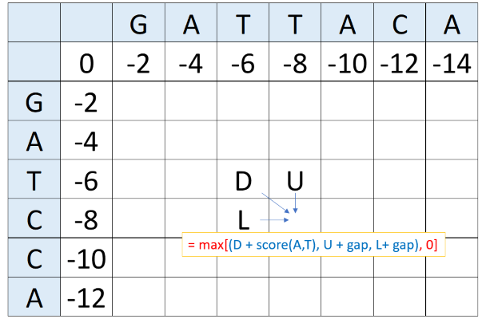

<span style="color:purple">
**Assignment goals:** <br>
**1. Implement the Smith-Waterman algorithm for local alignment** <br>
**2. Analyze the score of an alignment to determine whether or not sequences are related** <br>
**3. Understand and implement the center star algorithm for multiple sequence alignment**
\span

```{r setup, include=FALSE}
knitr::opts_chunk$set(comment = "")

source("pairAlign.R")
```

<span style="color:red"> Please write in code chunks or blue text the answers to all questions that are in green in this .Rmd file. Upload a knitted html file titled "Asn4LastnameFirstname.html" and the Rmd to Canvas by 11:59pm CST the Friday after discussion.\span

This assignment continues with the subject of sequence alignment, moving from global alignment to local alignment. With local alignment, instead of finding the best alignment between the entirety of two sequences, one finds an alignment with the best score among all pairings of subsequences of the two sequences being aligned. After local alignment, the assignment proceeds to the subject of multiple sequence alignments (aligning more than 2 sequences). Finally, you will leran how to implement the center star algorithm for multiple sequence alignment.

## Part 1: Local Sequence Alignment

The Smith-Waterman algorithm for local pairwise alignment is similar to the Needleman-Wunsch algorithm, with two exceptions:  

1. In addition to the three possible moves for filling `F[i,j]` from the three neighboring cells, a fourth option is available: a zero (0). Taking the option 0 signifies the start of a new local alignment. If the best alignment up to the current position has a negative score, it is better to start a new alignment rather than extend the old one.  
2. Instead of extending the alignment to the lower-right element, the local alignment ends at the index `F[i,j]` corresponding to the highest score in the entire matrix.  

 
<br>

The above is a visual demonstration of how to fill in the alignment matrix, in which the equation in BLUE is the Needleman-Wunsch Algorithm and the equation in RED is the Smith-Waterman Algorithm (described below).

<span style="color:green">1.1 Write a function implementing the Smith-Waterman algorithm to obtain the alignment matrix. Use a score of +3 for matches, a score of -1 for mismatches, and a score of -2 for gaps. The negative value for the mismatch in this case is important because for a local alignment, there is also the option to fill in a matrix element with 0 if the diagonal, top, and left give negative numbers. The 0 option means that there is no penalty for choosing to start to align the smaller sequence anywhere along the larger sequence. Mismatches, accordingly, should be "worse," i.e. scored lower. You may want to consult your global alignment function from assignment 4.\span 

<span style="color:green">1.2 What is the alignment matrix that Smith-Waterman generates for the sequences CCGATATGGCTTATGATCCA and GATTACAGGGCTTAAGCT? \span

<span style="color:green"> 1.3 What is the score of the best local alignment of these two sequences? Use the pairAlign() function to find the local alignment between these two sequences (set `type = "local"` in your function call).\span 

## Part 2: Analysis of the significance of an alignment
Given the relative nature of our scoring scheme, it is not possible to assess whether, given a particular alignment score, two sequences are related or not. To assess significance, we will conduct a permutation analysis in which we sample many sequences with identical amino acid composition (but in a non-identical order), and observe the distribution of alignment scores that result. We can see where our alignment score falls in this distribution to assess the probability of an alignment score as high or higher than that we observe given a null model of no evolutionary relationship. \span

The following function is modified from https://a-little-book-of-r-for-bioinformatics.readthedocs.io/en/latest/src/chapter4.html, and it generates X number of randomized sequences with the same length and amino acid composition (on average) as the inputted sequence. 

```{r}
#modified version of generateSeqsWithMultinomialModel() from https://a-little-book-of-r-for-bioinformatics.readthedocs.io/en/latest/src/chapter4.html

generateSeqs <- function(inputsequence, X){
  #split inputted string into vector of individual characters
  inputsequencevector <- strsplit(inputsequence,"")[[1]]
  mylength <- length(inputsequencevector)
  mytable <- table(inputsequencevector)
  letters <- rownames(mytable) 
  probabilities <- mytable/mylength #store the probabilities of letters
  
  #sample total number of characters needed to generate X random sequences of length myLength
  seqset <- sample(letters, mylength*X, rep=TRUE, prob=probabilities) 
  
  #apply paste0() to collapse vector of characters into a vector of character strings of the original length
  seqs <- vapply(seq(1, mylength*X, mylength), function(i) paste0(seqset[i:(i+(mylength-1))], collapse = ''), inputsequence)
  
  return(seqs)
}
```

<span style="color:green"> 2.1 Generate 1500 permuted sequences of the amino acid sequence ARDCRKRHBD using generateSeqs(). Then in a for loop, iteratively align "QGHDPKACRKZNCL" to each of these permuted sequences with `substitutionMatrix="BLOSUM62"`, `gapOpening = -8` and `gapExtension = -2`, and save the alignment scores to a vector (Hint: We only want to store the alignment *scores*. `scoreOnly = FALSE` by default.). \span

<span style="color:green"> 2.2 Create a histogram of your permutations' alignment scores. Calculate the probability of observing a score greater than or equal to -4 from your permutation analysis, and comment on the evidence for evolutionary relatedness of these two sequences (Hint: you want to find the proportion of scores greater than or equal to -4 out of all of the sequence scores.) \span

You may notice that performing these 1500 permuted pairwise alignments takes a noticeable amount of time, even for such short protein sequences. This reflects the fact that pairwise alignment is not computationally efficient. This becomes problematic if you want to perform a pairwise alignment with the millions of sequences in NCBI's databases, for example. However, in performing a database search, we might not necessarily care if our query sequence is being perfectly compared to each of the millions of sequences in the search database. Instead, we only care that the comparison is "good enough" to positively identify putatively related sequences, and minimize the chance that it falsely picks up unrelated sequences, while being conducted quickly enough to be of practical use. This captures the **heuristic** spirit of pairwise alignment algorithms such as **BLAST**. We will return to this problem in lecture soon.

## Part 3: Multiple sequence alignment

While pairwise alignment has its uses in database searching and gene functional annotation, there are many other uses for sequence alignment that require the optimal arrangement of many genes into one alignment scaffold, including phylogenetic analysis, distant homolog detection, and gene family analysis. The alignment of three or more genes or proteins is referred to as **multiple sequence alignment**.  

The dynamic programming algorithms introduced previously could theoretically be applied to multiple sequence alignment. Instead of recursively filling in a 2-dimensional F matrix, we would instead fill in an n-dimensional matrix to align n sequences. Similar to the above, this approach would be guaranteed to determine the optimal alignment between sequences. However, as we saw at the end of the last section, these algorithms are already stretched to the limits of computational efficiency with pairwise alignment. <span style="color:purple"> This computational limit thus makes dynamic programming approaches to multiple sequence alignment all but impossible. <span style="color:black"> Therefore, there are various heuristic approaches to multiple sequence alignment, packaged in many different alignment programs. \span

 
**Progressive algorithms** for sequence alignment are the most straightforward and historically the most widely used. First, a progressive alignment algorithm coarsely calculates phylogenetic distance measurements between the sequences to be aligned. It then finds the most similar sequences and constructs global pairwise sequence alignments between pairs. The multiple sequence alignment is then built progressively by incorporating increasingly more distant pairs into the growing alignment until all sequences are included. <span style="color:purple"> While efficient and widely used, these algorithms have several shortcomings. First, if an alignment error is made at any stage during the progressive growth of the alignment, it will be propagated without correction when more sequences are added. In addition, these algorithms do not perform well when attempting to align distantly related sequences. \span  

**Iterative algorithms** for sequence alignment are similar to progressive algorithms, except they include an additional step of iteratively re-aligning the starting seed sequences as more and more sequences are added to the alignment. <span style="color:purple"> This serves to fix the error propagation issues of progressive alignment, but at the expense of computational efficiency. These algorithms have the same difficulties as progressive alignments in aligning highly diverged sequences. \span  

Finally, various algorithms employ the probabilistic framework of **Hidden Markov models (HMM)**. These approaches build off of the idea that evolution can be modeled as a Markov process, but with a much more elaborate HMM implementation that we will not get into. <span style="color:purple"> One area in which HMM algorithms have achieved particular success is in the detection and alignment of very distantly related gene sequences.\span  

The EMBL-European Bioinformatics Institute provides online servers and links to descriptions for several common multiple sequence alignment programs: http://www.ebi.ac.uk/Tools/msa/

### The Center Star algorithm

Let's build our own multiple sequence alignment algorithm. We will implement a very simple approximation algorithm for multiple sequence alignment called the **Center Star** algorithm. To understand how it works, let $S_1$, $S_2$, $\ldots$, $S_k$ be $k$ sequences to be aligned. **Let the distance $D(S_i,S_j)$ between two sequences be the number of mismatches (where an indel, or insertion/deletion, is considered a mismatch) AFTER aligning the two sequences according to some exact global pairwise alignment algorithm (such as Needleman-Wunsch)**. For example, if we have two strings "ABCBA" and "ACBCA", then their distance is 3 because only the first and last coordinates match, with 3 mismatches in between. So, consider the sequences "ATLWGK" and "LTKWHGTA". To find their distances for the Center Star alignment algorithm you would first do:

```{r}
suppressMessages(library(Biostrings)) #silently loads Biostrings functions
source("pairAlign.R")
pairAlign("VTLWGK","LTKWHGTV", substitutionMatrix = "BLOSUM50", gapOpening = -2, gapExtension=-2, type="global")
```

And then compute the distance of this alignment, which is 5.

The **Center Star** algorithm starts by computing the distance $D(S_i, S_j)$ of every possible pair of sequences $S_i$ and $S_j$ among the $k$ given sequences. Then, it finds the sequence $S_c$ that minimizes the sum $\sum_{j \neq i} D(S_i,S_j)$ (the sum for fixed $i$) among all $i \in \{1,2,\ldots, k\}$ (that is, the sequence that minimizes the total distance to all other sequences), which is the so called *Center* of the star. The multiple sequence alignment then is the set of pairwise optimal alignments between any of the other $k$ given sequences and $S_c$.  

For example, consider the sequences 

```{r}
S_1 <- "VCLWTK"
S_2 <- "LKTGV"
S_3 <- "MVLGVTK"
```

Then, notice that:

```{r}
pairAlign(S_1, S_2, substitutionMatrix="BLOSUM50", gapOpening = -2, gapExtension=-2, type="global")
pairAlign(S_1, S_3, substitutionMatrix="BLOSUM50", gapOpening = -2, gapExtension=-2, type="global")
pairAlign(S_2, S_3, substitutionMatrix="BLOSUM50", gapOpening = -2, gapExtension=-2, type="global")
```

So that

```{r}
D_12 <- 5
D_13 <- 4
D_23 <- 5
```

Then, we want to find the sequence that minimizes the total sum of its pairwise distance to all other sequences. These are given by:

```{r}
Sum_1 <- D_12 + D_13
Sum_2 <- D_12 + D_23
Sum_3 <- D_13 + D_23
```

so that

```{r}
min(Sum_1, Sum_2, Sum_3)
```

which corresponds to either `Sum_1` or `Sum_3`. When there is a tie, choose the longest sequence. If the lengths are the same, then the choices are considered equivalent. We can break the tie easily in this case, since sequence 3 is longer than sequence 1, **meaning that $S_c = S_3$ in this example**. Then, the multiple sequence alignment is:  

```
    Center: "M" "V" "L" "G" "V" "T" "K"
Sequence 1: "V" "C" "L" "W" "-" "T" "K"
Sequence 2: "L" "K" "T" "G" "V" "-" "-"
```

**Make sure you understand this example before you proceed.** Conveniently for us, both sequences align to the center sequence such that no gaps are introduced in the center sequence, meaning that we can simply stack the alignments on top of each other to generate our multiple sequence alignment. But this is not always the case. If there is a difference in gapping behavior in the alignments between the center sequence and the various non-center sequences, then we need to introduce appropriate gaps in our multiple sequence alignment to ensure that all columns contain the alignment of each non-center sequence to the appropriate position in the center sequence.

The code below contains a function `buildMSA()` that does this process for us by taking in specifically formatted data and outputting a named matrix containing a Center-Star multiple sequence alignment.  **Your goal is to create a function 'centerStar' that starts with a list of sequences, finds all of the inputs to 'buildMSA' and uses 'buildMSA' to produce the multiple sequence alignment.**

```{r}
# INPUT ARGUMENTS
# patterns : list of char vectors
#            each vector patterns[[i]] contains the version of the CENTER sequence that arises from the pairwise alignment between the center sequence and sequence[i]
# subjects : list of char vectors
#            each vector subjects[[i]] contains the alignment of sequence[i] after a pairwise alignment with the center sequence
# center   : integer
#            index of the sequence in the original sequence list that is the center. 
buildMSA <- function(patterns, subjects, center) {
    MSA <- rbind(patterns[[1]], subjects[[1]])
    for(i in 2:length(patterns)) {
        j = 1 #index in new row
        k = 1 #index in alignment of center sequence to sequence i
        m = 1 #column index of MSA
        maxLength = ncol(MSA) + length(patterns[[i]])
        newRow = character(maxLength)
        while(k <= length(patterns[[i]]) && m <= ncol(MSA)) {
            if(patterns[[i]][k] == MSA[1, m]) {
                newRow[j] <- subjects[[i]][k]
                j <- j + 1
                k <- k + 1
                m <- m + 1
            } else if(MSA[1, m] == "-") {
                newRow[j] <- "-"
                j <- j + 1
                m <- m + 1
            } else if(patterns[[i]][k] == "-") {
                if(m == 1) {
                    MSA <- cbind(rep("-", nrow(MSA)), MSA)
                } else {
                    MSA <- cbind(MSA[, 1:(m-1)], rep("-", nrow(MSA)), MSA[, m:ncol(MSA)])
                }
                newRow[j] <- subjects[[i]][k]
                m <- m + 1
                j <- j + 1
                k <- k + 1
            }
        }
        while(k <= length(patterns[[i]])) {
            MSA <- cbind(MSA, rep("-", nrow(MSA)))
            newRow[j] <- subjects[[i]][k]
            k <- k + 1
            j <- j + 1
        }
        while(m <= ncol(MSA)) {
            newRow[j] <- "-"
            m <- m + 1
            j <- j + 1
        }
        newRow <- newRow[1:(m - 1)]
        MSA <- rbind(MSA, newRow)
    }
    rownames(MSA) <- c("    Center:", paste0("Sequence ", 1:(nrow(MSA)), ":")[-center])
    colnames(MSA) <- 1:ncol(MSA)
    return(MSA)
}
```

Before we can use this function though, we need to create the inputs to this function.

The expected input consists of two list objects and an integer. The first list `patterns` contains all the alignments of the center sequence with other sequences. So for our example above, `patterns` would simply be

```{r}
patterns <- list(c("M", "V", "L", "G", "V", "T", "K"), c("M", "V", "L", "G", "V", "T", "K"))
```

and then `subjects` contains the alignment of each non-center sequence against the center sequence, i.e.

```{r}
subjects <- list(c("V", "C", "L", "W", "-", "T", "K"), c("L", "K", "T", "G", "V", "-", "-"))
```

The final argument is an integer `center` that stands for which sequence in our original list of sequences is the center sequence. Since we found that sequence 3 was the center sequence, we can say the following:

```{r}
center <- 3
```

<span style="color:green"> 3.1 <br>
a) Describe how the `buildMSA()` function works. <br>
b) In the `buildMSA()` function, for each additional sequence considered, a new row of the matrix gets progressively constructed, then it is appended to the matrix once completed. What happens when a gap occurs in the alignment between the center sequence and sequence i that does not occur in the multiple sequence alignment up to this point? (Hint: look at the condition `else if(patterns[[i]][k] == "-")`)

When we input this data into `buildMSA()`, we get:

```{r}
buildMSA(patterns, subjects, center)
```

Nice, it works. But unfortunately, your very clumsy TA has misplaced the code that would, given a list of sequences, output the patters, subjects, and center for us to feed into `buildMSA()`. Oh no!

Let's just build it ourselves.

First off, there is the issue of generating pairwise alignments between sequences. We could simply arrange our sequences along each margin of a symmetrical matrix, then generate pairwise alignments for each element of the matrix. This could work, but then we are doing extra work in two ways:

1) The diagonal of the matrix involves aligning each sequence against itself, which is wasteful
2) The two triangles of the matrix mirror each other, so even when you ignore the diagonal, you are doing twice the necessary work.

So how do we perform our alignments most efficiently? Enter the handshake problem.

### The handshake problem
For any population with $n$ members, the number of unique pairwise matches between members is given by $n*(n-1)/2$. A common way to think about this problem is the handshake problem.

Imagine that at a party, there are $n$ people in attendance. The goal of this party is for each person to shake hands with each other person exactly once. One need not shake one's own hand. The first person, $p_1$, can shake hands with $p_2,p_3,...,p_n$ because nobody has shaken hands yet. Therefore, the number of people with whom $p_1$ can shake hands is given by $n-1$. Let's now consider the next person $p_2$. As $p_2$ has already shaken hands with $p_1$, the pool of available people has shrunk in size by 1 to $n-2$ people. This pattern continues up until $p_{n-1}$, whose pool consists solely of $p_n$. By the time we consider $p_n$, they have already shaken hands with every other person, so our scenario is complete.

In the end, the number of handshakes that has occurred is given by $(n-1)+(n-2)+...+1$, which collapses to $n*(n-1)/2$. The proof thereof is left as an exercise for the reader.

#### Implementation
Consider the following iteration:
```{r}
guests <- c("Ronda", "Eustace", "Benedigo", "Philomena", "Caecilius")
vector <- character(10)
k <- 1
for(i in 1:(length(guests) - 1)) {
    for(j in (i+1):length(guests)) {
        vector[k] <- paste0(guests[i], "-", guests[j])
        k <- k + 1
    }
}

shakeMatrix <- matrix("", 5, 5)
dimnames(shakeMatrix) <- list(guests, guests)
shakeMatrix[lower.tri(shakeMatrix)] <- vector
shakeMatrix
```

As we can see from this output, the matching occurred much as described above. We first consider Ronda, because Ronda is the first person listed in our vector of names. Ronda shakes hands with every other person, then we move on to consider Eustace. Eustace has already shaken hands with Ronda, so Eustace begins shaking hands with Benedigo, etc. When we reach Philomena, Philomena only has Caecilius left to shake hands with (perhaps *in horto*). Note that the iteration does not consider Caecilius because there is no need. All guests have shaken hands by the time he would have been considered.

### Generating Pairwise Alignments
This data is shaped properly to fill in a triangle of a symmetrical matrix that has the guests lying along each margin. It can fill in the lower triangle column by column, or the upper triangle row by row. Since R's matrix implementation is column-priority, it is often easier to populate the lower triangle. There are a few approaches to this problem:

1) Start with the data in a matrix
2) Work with the original vector until the last moment

<span style="color:purple">Approach 2 uses less overall memory, but approach 1 is a bit easier to understand and results in more elegant code. So let's consider approach 1.</span>

#### Approach 1 (Start with matrix)
Moving forward, let's move away from abstractions and start working with amino acid sequences. For the following operations, I will be using the sequences in `peptides`, which is a vector of strings:

```{r}
peptides <- c("ARDCRKRHBD", "QGHDPKACRKZNCL", "ACGDCRKRHBD")
```

#### Alignments
Let's quickly generate the pairwise alignments between these sequences.

```{r}
## Initialization
n <- length(peptides)
align1 <- matrix("", n, n)
align2 <- align1

## Generate alignments
for(i in 1:(n-1)) {
    for(j in (i+1):n) {
        alignment <- pairAlign(peptides[i], peptides[j], "BLOSUM62", -8, -2)
        align1[j, i] <- alignment[[1]]
        align2[i, j] <- alignment[[1]]
        align2[j, i] <- alignment[[2]]
        align1[i, j] <- alignment[[2]]
    }
}
align1
align2
```

The way that our data is arranged, each column of `align1` contains the alignments of each sequence in `peptides` to every other sequence, and the corresponding column of `align2` contains the other half of the alignment pertaining to the other sequences.

<span style="color:green"> 3.2 Describe how the nested for loop in the example above iterates over the vector `peptides` such that unique pairwise matchups are outputted. </span>

<span style="color:green"> 3.3 Generate pairwise alignments for each unique pairing in `sequences` using `pairAlign()`, storing the `$Pattern` element from each alignment in one matrix and the `$Subject` element in the other. Use "BLOSUM62" as your substitution matrix, use a gap opening penalty of -10, and a gap extension penalty of -2.</span>

```{r}
sequences <- c("MATCHQQQ", "MARCH", "MATCH", "QQQMATCH", "MATQQQCH")
```

#### Distance matrix
Since our data is already in matrix form, making the distance matrix is relatively simple, but there is a bit of intermediate R technique that we can employ. Consider the following operations:

```{r}
distances <- sapply(mapply(`!=`, strsplit(align1, ""), strsplit(align2, "")), sum)
distanceMatrix <- matrix(distances, n, n)
dimnames(distanceMatrix) = list(peptides, peptides)
distanceMatrix
```

So this worked, but how? Let's break that first command down, working from the inside out. We should be familiar with `strsplit()` by now, but it is important to reiterate here that **R stores a matrix's data as a single vector in column priority order**. So when we pass a matrix into a vectorized function such as `strsplit()`, the information about dimension is lost, and we are now dealing with a one-dimensional object. Therefore, `strsplit(align1, "")` outputs a list with the same length as the number of elements in `align1`, with each list element being a character vector that comes from splitting up the original strings:

```{r}
strsplit(align1, "")
```

We get 9 elements from a 3 x 3 matrix, exactly as expected. 

Now, there is the issue of this `mapply()` business. `mapply()` is a member of the -apply family of functions in R that allows you to, aptly, apply some given function to the elements of a list- or vector-like object. The "m" in `mapply()` stands for *multiple*, and it allows us to apply some operation using the first elements of those objects, then the second elements, etc. When we are calculating distances between sequences, we want to match up the correponding elements of `align1` and `align2`, so `mapply()` is perfect for us.

The function we want to apply here is the `!=` operator, so we pass it to `mapply(function, object1, object2, ...)` enclosed in grave accents. We get the following output:

```{r}
mapply(`!=`, strsplit(align1, ""), strsplit(align2, ""))
```

Now, for each of these comparisons, we want to find out how many positions are TRUE. We know that we can accomplish this by summing the logical vectors stored in each list element, and we can do this by using `sapply()` to apply `sum()` to this object: 

```{r}
sapply(mapply(`!=`, strsplit(align1, ""), strsplit(align2, "")), sum)
```

And our distances are nicely calculated for us in one line. The last step of this operation is making our vector into a matrix, which we can accomplish very simply because the vector still remains in column-priority order. We just need to give it the proper dimensions.

<span style="color:green"> 3.4 For each pairwise alignment, calculate the distance between the aligned sequences, and store the distances in a vector. Use this vector to populate the **distance matrix** for our vector `sequences`.

### Finding the Center Sequence

Finding the center sequence is simply a matter of taking the column sums of the distance matrix and then finding the minimum:

```{r}
possibleCenters <- which(colSums(distanceMatrix) == min(colSums(distanceMatrix)))
center <- possibleCenters[which.max(nchar(peptides[possibleCenters]))]
```

<span style="color:green"> 3.5 How would finding the column sums of our distance matrix help us to find our center sequence? </span>

<span style="color:green"> 3.6 Find the center sequence for `sequences` and show the steps you took to get there. </span>

And now, generating the data to pass to `buildMSA()` is a simple matter of retrieving the appropriate columns from `align1` and `align2`:

```{r}
patterns <- strsplit(align1[,center][-center], "")
subjects <- strsplit(align2[,center][-center], "")
patterns
subjects
```

And in the end, the MSA looks like this:
```{r}
buildMSA(patterns, subjects, center)
```

<span style="color:green"> 3.7 For each alignment against the center sequence, retrieve the list of patterns and the list of subjects. Use this data along with the index of the center sequence to run `buildMSA()` on the sequences in `sequences` from 3.3. \span  

```{r}

```

### Putting it all together

<span style="color:green"> 3.8 Let's put everything together. Write a function `centerStar()` that takes in a list of sequences and uses `buildMSA()` to output the multiple sequence alignment. Test this function on the globin protein sequences contained in globins.fasta, which have been loaded into R for you as `globins`, which is a vector of concatenated uppercase strings. Again, use "BLOSUM62", gapOpening = -10, and gapExtension = -3. \span  

```{r}
centerStar <- function(sequences, substitutionMatrix, gapOpening, gapExtension) {
    #Your code here
    return()
}

globins <- unlist(seqinr::read.fasta("globins.fasta", seqtype = "AA", as.string = T))
```


<span style="color:purple"> While sequence alignment developed historically in the context of evolutionary analysis (and was introduced that way in these exercises), many of these algorithms are finding additional uses with modern sequencing technologies. For example, if we sequence an individual's genome and want to see where his or her genome differs from a reference genome, we would conduct pairwise alignments between genomic regions. Similarly, pairwise alignment to a reference genome is used to infer from where reads from assays such as ChIP-Seq or RNA-Seq derived. Furthermore, sequence alignment is used in the initial assembly of genomes from millions of short, overlapping reads. Thus, the algorithms and difficulties in sequence alignment relevant for evolutionary analysis have deep implications for many different fields of biology. \span 