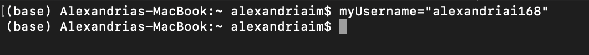

<span style="color:purple">
**Assignment goals:** <br>
**1. Learn basic Unix commands** <br>
**2. Write and run basic Unix bash scripts** <br>
**3. Login and submit jobs to the Midway Supercomputer**
\span

<span style="color:red"> Please upload a knitted HTML file titled "Ans7LastnameFirstname.html" and the Rmd to Canvas by 11:59pm CST the Friday after discussion. \span 

**This assignment requires access to a Unix command prompt. Mac users may access the ‘Terminal’ application under Applications > Utilities > Terminal. Windows 10 users may install a linux subsystem, see https://docs.microsoft.com/en-us/windows/wsl/install-win10. Please see the end of the assignment for more details. If you have difficulty installing this program please talk to your TA or Dr. Haddadian.** 

In this assignment we will learn the basics of **command-line** operations in **Unix**, with a focus on learning to connect to and interact with remote computer systems. First, we will learn the command-line equivalents of many of the basic file management actions you routinely perform on your own computer. Next, we will learn how to connect to the **Midway** high performance computing cluster and perform analyses. <span style="color:purple"> **The details of this assignment will be important for the upcoming assignment (assignment 8) as well as your final project, so be sure to ask questions about anything that is unclear.** \span

### Programs for Windows Users
Some of these exercises require access to a Unix command prompt. This could be achieved by logging onto Midway through program PuTTY (or other program if you already have one). Instead of connecting to Midway through the ssh command in Terminal, Windows users must install the program PuTTY (http://www.chiark.greenend.org.uk/~sgtatham/putty/download.html). After connecting to Midway through PuTTY, you will be presented with the same Unix command prompt accessible from Mac computers. Information on connecting from Windows is also provided on the RCC website (https://rcc.uchicago.edu/support-and-services/access).  

PuTTY allows you to log onto Midway to submit analyses and modify files that have already been uploaded. However, in order to transfer files to and from Midway (scp from lab), you will need to download a secure file transfer client program WinSCP (http://winscp.net/eng/index.php). Once again, the RCC website provides details about connecting to Midway through WinSCP (https://rcc.uchicago.edu/docs/data-transfer/index.html#winscp-gui-for-windows-clients).  

 Alternatively, as a more permanent solution, you could download the program Cygwin (https://cygwin.com/install.html), which gives you a Unix command prompt on your local Windows machine. 

## Part 1: Command-line operations in Unix

An **operating system** (OS) describes the suite of software that forms the base of a computer machine. For example, the Windows OS refers to a set of programs that tells your computer how to display features and accept commands to perform various computations. This includes the display of the graphic user interface (GUI) that we are all familiar with, allowing for point-and-click navigation and computation. At their core, most modern OS’s (apart from Windows) are based on the **Unix OS**. In this assignment we are going to move one step closer to the Unix OS from our familiar GUI perch. We will interface with Unix through the *shell*, which refers to a program that supplies a command-line interpreter for the user to direct commands to the computer core. The particular shell we will use is the bash shell (standing for **B**ourne-**a**gain **sh**ell), which is the Unix shell you are most likely to encounter in bioinformatics applications.  

<span style="color:purple"> Working from the command line is powerful. It allows for the automation of repeated sequences of operations—for example, moving, combining, or extracting data. <span style="color:black"> Many of us have wasted substantial time repeating the same series of point-and-click operations from our computer GUI. The command line gives us the ability to automate this task. Although it takes some upfront investment, this automation is fruitful in the long run, particularly when it encodes a data handling tactic we plan to use many times in the future. \span

<span style="color:purple"> Working from the command line is also flexible. <span style="color:black"> It can be a very involved process to write a new program that operates in the confines of our Windows or Mac OS GUI. However, it is not difficult to write a program that operates a level deeper at the command line to do things we would otherwise be unable to code. \span  

<span style="color:purple"> Finally, working from the command line is the only way to access remote clusters of high-performance computers. <span style="color:black"> Given the large amount of data in modern biological analyses, external computing resources are becoming a necessity. For the most part, it is impossible to control analyses on external computers through a GUI interface. Through the command line, however, we can login to that computer and perform computations as if we were standing in front of that very same computer. This gives us the power to interact directly with much more powerful computing hardware, from the comfort of wherever our desktop or laptop currently lays. However, working from the command line comes with certain risks. Your computer will do whatever you tell it to do from a command. As such, it is possible to permanently delete files or whole chunks of your hard drive with an errant punctuation mark or character. It is thus important to take care in constructing commands and documenting past actions to avoid making a mistake to which “ctrl-Z” has no power to fix. \span  

If you have a personal Mac computer, find and open the “Terminal” or open Linux distribution of choice. A small window opens, and after a brief login, presents you with a command prompt. The Terminal command prompt operates similar to the command prompt we have seen in R. The user types a command in the language interpreted by the command prompt, types <Enter> and an action is performed. Remember that you can use the up arrow to catch your previous commands. <span style="color:purple"> 


<br>

We are now going to explorer how to navigate the file system of your computer from the command line. Knowledge about how the file system is arranged is essential for using a computer at the command line. We all have an intuition as to how file systems are arranged from our experience working with “Folders” of files on our traditional computer OS. The trick now is to learn the commands that correspond to the double clicks and “New Folder” buttons we would use in something like the Mac Finder, as these GUI features are not available to us when working on a remote device.  

There are two directories of special importance for moving through the file system of your computer: your **home directory**, and your **root directory**. <span style="color:purple"> The root directory is the most inclusive folder on the system <span style="color:black">, which contains all other files and folders. If you were clicking the “back arrow” on a GUI folder navigator, the root directory is as far back as you can go. <span style="color:purple"> The home directory is where you are initially logged onto when you open a new Terminal window. We can figure out the absolute path to our current location, the home directory, with a simple command: `pwd` (present working directory). <span style="color:black"> The `pwd` command should be used liberally when working at the command line to ensure you are always in the proper location to access and deposit files of interest.

<span style="color:green"> 1.1 What is the path to your home directory in your computer? \span

The `pwd` command returns the **absolute path** to your current directory.<span style="color:purple"> An absolute path originates from the root directory in describing <span style="color:black"> the location of a directory or file. As we saw above, the absolute path starts with a `/`. This isolated `/` with no preceding characters signifies our root directory. To get to our *home* directory from the *root* directory, we follow the pathway of subdirectories indicated in the absolute path. If this is unclear, open the **Finder** in your computer and convince yourself how this absolute path tracks with your normal conception of folder structures.  

In contrast to an absolute path, <span style="color:purple"> a **relative path** specifies the location of a directory or file relative to your current location (the working directory). <span style="color:black"> For example, the absolute 
path to my home directory is `/Users/smithmj`. Within `smithmj`, I have a folder `scripts` containing another folder named `funstuff` that contains the shell script `HideFiles.sh`. The absolute path to `HideFiles.sh` would be `/Users/smithmj/scripts/funstuff/HideFiles.sh`. However, given my current directory is `smithmj`, the relative path would be `./scripts/funstuff/HideFiles.sh`. 
<span style="color:purple"> Notice the period placed prior to the first forward slash. This period represents the current directory. If this period were not present, the computer would try to look for a `scripts` file in the root directory, as an initial forward slash tells the computer to reorient to the root directory. \span  

<span style="color:green"> 1.2 What would be the relative path to `HideFiles.sh` be if our present working directory was the `Users` directory? What would the relative path to `HideFiles.sh` be if we were currently in the `funstuff` folder? \span  

For example, on my computer the files for BIOS11141 are nested deep within my file system. The absolute path to the CompAsn6 contents on my computer is:   `/Users/smithmj/Documents/UChicago/Bioinformatics/Labs/Lab6`  

If I were performing manipulations or analyses on files in this folder from my home directory, it would be a pain to repeatedly type this entire path at the command prompt for every file I access or create. Instead, it would be useful to move my present working directory to the “Lab6” folder.<span style="color:purple"> This is accomplished with the `cd` (**c**hange **d**irectory) command: \span  


The `cd` command can take you to whatever absolute path or relative path you specify. If you don’t supply the `cd` command with a path (i.e. you just type and execute `cd`), the default option is to bring you back to your home directory. This can be useful if you “get lost” in your navigation and just want to start over.  

My `Labs` folder also has a `Lab5` subdirectory. A quick way to navigate to `Lab5` from the `Lab6` folder is as follows:  


<span style="color:green"> 1.3 What are the two periods `..` referencing? \span  

<span style="color:green"> 1.4 Navigate to your home directory. Now construct a command with `cd` that takes you to your root directory from your home directory. Paste your command into your assignment exercise document. \span  

Note that for Windows users, to get to the files normally seen with the GUI, you must navigate to `cd /mnt/c/Users/username`.

One tip that will save you time is **tab completion**. When you are referencing a file or directory, you can begin to type its name and hit the <tab> key to complete the name, assuming the letters you have typed so far are unique to a particular file or directory. To explore this behavior, navigate to your home directory. Type `cd Desk<tab>`, and notice how the tab completes the name of the “Desktop” subdirectory. Return to your home directory. Now type `cd D<tab>`. Notice that nothing happened? This is because two or more directories in your home directory begin with a D. However, if you enter `<tab>` a second time, the Terminal will echo back to you all of the available options that start with “D.” This might include `Desktop`, `Documents`, and `Downloads`. If you complete enough letters for any directory such that it is unique, then press `<tab>`, Terminal will complete the path.  

<span style="color:purple"> The third command useful for directory navigation is `ls` (list). <span style="color:black"> This command lists the contents of the current working directory. If an absolute or relative path is provided, `ls` will list the contents of the given directory. From your home directory, test out the `ls` command with the following prompts: \span  

`ls`  
`ls /`  
`ls ./Desktop`

Similar to R, basic bash functions come with documentation. Explore the documentation of the `ls` command with `man` (for **man**ual):  
`man ls`  
	
This brings up the manual for the `ls` command. You can scroll up and down with the arrows, scroll by page with “z” and “w,” and exit the manual page by typing “q”. 

<span style="color:green"> 1.5 Using the manual and simply testing commands in your home directory, explain what happens with the following commands, in which additional **options** are passed to `ls` with the “-” character. Note, something like `ls -lS` is equivalent to `ls -l -S`. \span  

<span style="color:green"> `ls -l` (that is the letter ‘l’, not the number 1)  \span  

<span style="color:green"> `ls -lS` \span   

<span style="color:green"> `ls -lt`  \span 

<span style="color:green"> `ls -ltr`  \span

<span style="color:green"> `ls -g`  \span  

Let’s introduce the **wildcard** character. In most commands that take a path as an argument, we can use the wildcard character `*` to increase the breadth of our search. From our home directory, we can try `ls *`. This is the broadest wildcard, and will apply the `ls` command to list the contents of all subdirectories in our working directory. 

<span style="color:green"> 1.6 What happens when you try `ls ./D*` from your home directory? \span 

Now that we’ve learned how to navigate directories, let’s learn the commands for handling files from the command prompt. For these exercises and the homework, please use the file `pcfb.zip`. This zip file contains the files necessary for examples provided in the book “Practical Computing for Biologists” by Haddock and Dunn (www.practicalcomputing.org). The appendix of this book, **available under the assignment 7 folder on Canvas**, contains a reference sheet of most of the common bash commands you will encounter. I encourage you to download this and consult it when conducting the following exercises.  
Save the zip file to your computer. In the Terminal, navigate to this folder, and execute `unzip pcfb.zip`. This will unpack the zip file and create several subdirectories.

<span style="color:green"> 1.7 What are the subdirectories that are in the newly created `pcfb` folder? What is the smallest size file in the `examples` subdirectory? \span 

Let’s explore how to add and remove new directories. Change directories to the “sandbox” directory of `pcfb`. Notice that it is currently empty (you can check it with the `ls` command). Execute the command `mkdir myDirectory`, and notice the addition of a new folder within `sandbox` (`ls -lF`). Now execute `rmdir myDirectory` and notice the disappearance of your directory. By default, `rmdir` is conservative and will only allow you to delete a directory that has no file contents. <span style="color:purple"> However, you need to be very careful with the `rmdir` (and the equivalent `rm` for files), because these commands are not like moving a file to the “Trash” where it could be recovered later. **These commands remove directories or files permanently**\span

Smilarly the `rm` (**r**e**m**ove) command is used to permanently delete a file from your computer. Its usage is simple, for example: `rm myScript.sh`. <span style="color:red">**As mentioned before, be careful in useing this command as files deleted with `rm` cannot be recovered!**\span

How about copying files? Let’s copy the file `structure_1s36.pdb` from the `examples` folder to `sandbox`.<span style="color:purple"> The command for copying files is `cp`, which takes two arguments: the relative or absolute path to a file of interest to be copied, and the relative or absolute path of the directory to where the file should be copied to. <span style="color:black"> For us, this second argument would be something like `./` since we are currently in the `sandbox` directory. We can also rename the copied file at this step if we want (for example, if we were copying a file into the same directory as the original), by specifying a file name in the second argument for example: `./newfilename.txt`. <span style="color:purple"> A similar command to `cp` is `mv` (move). <span style="color:black"> This command follows the same structure as `cp`, but instead of placing a duplicated file into the new location, it moves the file (and potentially renames it). \span  

<span style="color:green"> 1.8 Construct a command to **copy** the protein file `structure_1s36.pdb` from the `examples` folder to the `pcfb` folder. Then construct a command to **move** the newly duplicated file from `pcfb` to the `sandbox` folder. Paste both commands below. \span  

There are several ways to look at or edit the contents of a text file from the shell. First, let’s explore the program `less`. We can investigate our protein file by executing `less structure_1s36.pdb`.  

The protein structure file contains various descriptions at the beginning of the file (including how the structure was obtained experimentaly). The last part of the file lists all of the atoms of the protein and their three-dimensional coordinates; this is the portion that is read by a program to construct a three-dimensional model of the molecule (we will learn a lot more about this next quarter).

<span style="color:green"> 1.9 What protein is represented in this file, and from what organism? How many protein atoms are present in the structure? \span  

The program less only allows us to read the contents of a file, but we cannot make changes. There are several programs for file manipulation at the command line—we will use `nano` for this purpose. We could edit the protein file by executing `nano structure_1s36.pdb`. The keystrokes for file navigation in `nano` differs from `less`, but they are indicated at the bottom of the nano window (`^X` corresponds to simultaneously pressing `control` and `X`).

The `nano` program can also be used to <span style="color:purple"> create a new text file <span style="color:black"> by supplying a new filename as the argument to `nano`. Execute: `nano myScript.sh`. Here, we are creating a new text file with a `.sh` extension, indicating that we are going to turn it into an **executable ba*sh* script**.  

In the new `nano` window, type the following two lines of code to define our script:  
`#! /bin/bash`  
`echo “Hello, world”`

This first line contains a symbol called a **shebang**. The shebang tells the command line interpreter what program to use to interpret the subsequent lines of code. In this case, we follow the shebang with the absolute path to our *bash* program, telling the command line to treat the rest of the document as commands executed in a bash shell. The rest of the code defines what our script will do. Exit the nano window by typing the `control` and `X` keys, when asked if you want to save, type `Y`.
If we try to run this script (using the `./` command), we get the following error:


<span style="color:purple"> In order to execute the contents of a file from the Terminal, this file must have the proper **permissions** to be executed. <span style="color:black"> The current permissions of a file are listed in the extended output of the `ls -l` command we used before. The first column of this output indicates the various permissions a file can take. We are interested in the 2nd, 3rd, and 4th positions out of the ten characters of this shorthand. These characters indicate whether the file is allowed to be read (**r**), written to (**w**), or executed by (**x**) by the current user (you). If one of these symbols is replaced by a dash, it means this permission is not granted.

<span style="color:green"> 1.10 What permissions are initially present for the myScript.sh file? \span  

In order to give the current user (**u**) permission to execute (**x**) myScript.sh, execute the `chmod` (**ch**ange **mod**e) command: `chmod u+x myScript.sh`. The `u+x` nomenclature says to add the **x** permission to the user. We could construct other `chmod` commands to remove permissions (`u-x`), or change permissions for various other groups of users who might encounter our script. If we check the file again with `ls -l`, we can see that this file is now executable, and can be run as follows:  


## Part 2: Working on Midway

For this part you will need to be logged in to Midway. Once you login to Midway, it is as if you are now sitting at a keyboard directly in front of the Midway computer cluster. As we saw with our own computer, we are initially logged into our home directory on Midway. In order to connect to Midway you need to use the `ssh` command; for example my login command is

`ssh haddadian@midway2.rcc.uchicago.edu`

haddadian is my username and my password is my Cnet password.

**Windows users need to use two programs (PuTTY and WinSCP) to access Midway and to download any files. This is explained at the beginning of this document.**

<span style="color:green"> 2.1 Within your home directory on Midway, create a new subdirectory entitled `CompAsn7` using the `mkdir` command. Navigate to this new folder, and determine its absolute path. Paste these commands below. \span  

Your new `CompAsn7` folder is currently empty; however, we want to upload three files to this directory: `CompAsn7source.R`, `ORF1-1.cpp`, and `job-submit.sh`, available in the folder called Upload within the archive of assignment 7 files. To upload these files to Midway, open up a new Terminal window or tab **in your local computer (not on Midway)**. We are going to transfer these files to Midway using the `scp` command (**s**ecure **c**o**p**y), which is used to both upload files to a remote computer and to download the results. The scp command has the same usage as `cp`. The only difference is that one of the file paths refers to a file or directory on your local computer where you are executing the `scp` command, while the other references the absolute path to where the file is being deposited or downloaded in the remote computer. In order to upload all three files to Midway simultaneously from my computer, I would execute the following, and enter my password when prompted:  

`scp ~/Desktop/BIOS11141/CompBio/CompAsn7/Upload/* haddadian@midway2.rcc.uchicago.edu:~/CompAsn7`

<span style="color:green"> 2.2 Use `scp` commands (either per file or one command with a wildcard) to upload the three files to your CompAsn7 directory on Midway, and paste these commands into your lab report. Return to Midway, and check that the three files are now present in the CompAsn7 directory. \span

`CompAsn7source.R` and `ORF1-1.cpp` contain an ORF finder algorithm written using a hybrid of R and C++, which allows us to conduct ORF analyses several orders of magnitude faster than our loop-based algorithms written in R. This is important because today we will look to find all the possible open reading frames in Chromosome 1 of the human genome, which spans nearly two hundred million bases. If we were to attempt this computation on our personal machines using the suggested implementation from our previous lab, then it would take on the order of several hours to complete. \span

<span style="color:green"> 2.3 Instead of printing out the completed list of ORFs in R (which we would not be able to see easily from the command line), this script generates two `.csv` tables for ORFs in both the forward and reverse directions. What function in the `CompAsn7source.R` file is used to generate these outputs? \span

The other file we uploaded is a job-submit script. Instead of simply executing a command on the **node** to which we have logged in (the **login node**), we instead use a job submission script to direct our computational analysis to one of several **compute nodes** on the computer cluster.

<span style="color:green"> 2.4 Explain why you would log into dedicated login nodes and submit jobs to dedicated compute nodes, instead of doing both on the same node. (If you can’t think of a reason, execute the command `qstat` — This will show you the current queue (line of jobs) running or waiting to be executed.) \span  

Every user or group on Midway has a certain allocation of computer resources available for use. This is measured in **node hours**, the number of hours of computation that are used up by submitting jobs to compute nodes.  

We now need to open the job submission script and change some values.<span style="color:purple"> When you submit each job to the compute nodes, you will need to use a job submit script that tells the compute node scheduler how many nodes (processors) you need, how much time your job will take to run, the name of your job, and the actual commands to execute.<span style="color:black"> Open up the job submit script (named `job-submit.sh`) with `nano`. Inside will look like this:


The last 5 lines, which do not start with `#SBATCH`, contains the commands to execute the R script `CompAsn7source.R`.
All the SLURM parameters are declared with `#SBATCH`, followed by additional definitions that tell the SLURM scheduler how much allocation of what computer resources you request for this job.

Explanations for these parameters:

`--job-name=test:` Sets the name of the job to "test" <br>
`--time=00:00:01:` Reserves the computing resources for 1 second (or less if program completes before 1 second). <br>
`--nodes=1:` Requests 1 compute nodes. <br>
`--account=bios11141 :` The name of the account from which the ‘service units’ (the ‘currency’ that accounts for computing resource expenditures) used by this job is going to be charged. <br>
`--mem-per-cpu=8192:` Requests 8192 MB (~8 GB) of memory (RAM) per core. <br>

<span style="color:green"> 2.5 The job name is set to "test", which is not terribly descriptive. Choose a better name for this job and change the `job-name` parameter accordingly. What name did you choose?\span

The submit script currently requests one second of compute time. This is not quite enough time to complete the job. Change the `time` parameter to request **30** minutes of compute time. The account parameter is currently blank. Enter our class account `bios11141` so the scheduler knows which account to pull the resource allocation from.

<span style="color:green"> 2.6 What bash command is executed to run the `CompAsn7source.R` script? \span  

We need to complete one final step to copy the sequence data from the class directory on Midway to our personal CompAsn7 directories. Assuming that you uploaded the lab files to your CompAsn7 directory, execute the following command:

```
cp /project2/bios11141/CompAsn7/Homo_sapiens_Chr1.fasta ~/CompAsn7/Homo_sapiens_Chr1.fasta
```

With these parts done, we can now submit the job for Midway to run. \span  

To send our job to the compute nodes, we use the `qsub` command. This command stands for “**q**ueue-**sub**mit,” and its syntax is `qsub jobsubmitname` (swapping out jobsubmitname for your own job submission script name). 

**Execute this command now on your job submission script to submit your first supercomputer computation!** If everything goes well, your job should start running. You can check the status of your job by entering `qstat -u YourUserName`; You should see something like the following:  ..


<br>
The “R” in the “S” column means that the job is currently running. Other options that you might see are “Q” (queued) or “C” (completed). If you see a “C” in less than a minute, notify your TA; it probably means that something went wrong. 

After several minutes, your job should have produced two files: `Homo_sapiens_Chr1_ORFs_forward.csv` and `Homo_sapiens_Chr1_ORFs_reverse.csv`. These files contain the results of our ORF analysis. For Part 4, we will need to copy this data from Midway to our own laptops to perform some basic analysis. For Mac users, this will involve the same `scp` command we used above.<span style="color:purple"> Windows users need to use two programs (PuTTY and WinSCP) to access Midway and to download any files.<span style="color:black"> This is explained at the beginning of this document.

## Part 3: More commands in Unix

### The Cat Command

Download and unzip the file `pcfb.zip` to your computer as you did before. One useful program for file handling in the shell is `cat` (con**cat**enate), which takes a list of files as an argument, and combines them all together.

<span style="color:green"> 3.1 Navigate to the sandbox directory. Execute and compare what happens with the following two commands. What is each of the two commands doing? How are they different? What is the `>` symbol doing?  \span  

<span style="color:green"> `cat ../examples/*.seq` \span  

<span style="color:green"> `cat ../examples/*.seq > ./chaetognath.fasta` \span  

Remember back to assignment 2 when we used the `grep()` command in R to search a table for a keyword. There is an equivalent command `grep` that can be used from the Unix command line to search a file and return any lines that match the search query. For example, if I wanted to print out the lines containing headers from the above `chaetognath.fasta file`, I could execute: `grep “>” chaetognath.fasta`


<br>

<span style="color:green"> 3.2 The file `examples/shaver_etal.csv` contains various measurements in a comma-delimited text file. These measurements were obtained from various field sites, including one called “Toolik Lake”. Construct a command with grep that extracts all data entries from “Toolik Lake” and saves the output in a file called `toolik.csv`. Paste the command below. \span 

Another powerful feature of the command line is the pipe character `|`. This character redirects the output of a particular command to the input for the subsequent command. It thus can save potentially burdensome steps of saving intermediate search results to a separate file.  

As an example of its use, let’s say I wanted to find a previously executed command that involved the words “Toolik”. I could execute the `history` command and scan through the all of the previously executed commands. However, this could be a big pain to search through. Instead, I can use the piping character to redirect this output to the grep command, and print out all commands I have executed recently with the word “Toolik”:  


<br>
If you want to search a data file based of two different search terms, you could perform one grep search and save the result to an intermediate file, and then search this file with the second grep command. Alternatively, we could perform the first grep search, and pipe the output to the second grep search.  

<span style="color:green"> 3.3 Construct a piping command that first searches `shaver_etal.csv` for all observations from August (use the “Aug” search query), and then pipes these results to a second `grep` search for “Toolik Lake”. Save the results as a file `toolik_aug.csv`. Paste the command into your report. \span  

### Assigning Variables in Unix
Just like we can assign variables in R, we can assign variables in Unix! Let's say that I want to assign the number 54321 to the variable name "randomNumber".  This is how you do this in unix.  


You can also assign character objects in Unix.  My UCID is alexandriai168. Let's say I want to store my UCID username so it's easy to access later.  Here's how I'd accomplish this.  Notice that I flank my username with **quotation marks**.



If I want to call my variables, I put a `$` in front of the variable name.  In the example below, I use the echo command, which is equivalent to the `print()` command in R, to print out my varibles. I can also use these variables in commands you've learned in this lab.  In this example, I use `$myUsername` in place of typing out my full username.  


<span style="color:green">3.4. Assign your UCID to a variable called `myUsername` and use it to ssh into Midway2. Copy and Paste your commands into the answer file. </span>

### For Loops in Unix
It's no surpsise that we can also execute For loops in Unix. Before we do anything, copy over the directory called `Images` from the class folder into your current directory.

```
cp -r /project2/bios11141/CompAsn7/Images ~/CompAsn7/Images

```
Take a look inside the directory called `Images` using the `ls` command.  There are several images named img#.png for numbers 1-13.  The structure for For loops in Unix is below:


This for loop will iterate through all of the different files with names img*.png (so, all of the files in your Images directory), and echo (print) their names one by one.  

<span style="color:green">3.5. Create a new directry called `Images2`.  Copy and Paste your commands into the answer file.</span>

<span style="color:green">3.6. Use a for loop to `cp` all of the images into your new directory `Images2`. Copy and Paste your commands into the answer file.</span>

### Part 4: Working with results from Midway

<span style="color:red">For this part of the exercise, you will need access to a Unix command prompt or SCP client and an internet connection.

<span style="color:green">4.1. Use `scp` to retrieve `human_Chr1_ORFs_forward.csv` and `human_Chr1_ORFs_reverse.csv` from Midway. Provide the command you used below. </span>

<span style="color:green">4.2. Load the tables into R using `read.csv()` and examine the structure of the data by printing out the first few lines with `head()`.</span>

<span style="color:green">4.3. How many ORFs with a length of at **least 450 bases** (150 residue proteins) were detected in the forward and reverse directions of Chromosome 1 of the human genome? </span>

<span style="color:green">4.4. Chromosome 1 of the Homo sapiens reference genome is currently known to contain about 2100 genes that code for about 5000 proteins. a) Why might ORF and gene count be different? b) How can more than one protein be encoded by any given gene? Explain.</span>

<span style="color:green">4.5. How does the number of genes compare with the number of ORF's you obtained in question 4.3 above? Propose two reasons for any discrepancy. </span>

### Part 5: Putting it all together
Let's now put together all of the different skills you learned in this lab to run findORF on more chromosomes.

I wrote a new R script and job-submit script that runs findORF on 4 human chromosomes.  It's called `CompAsn7source-updated.R` and `job-submit-updated.sh`.  There are also the FASTAs for human chromosomes 2-4 in the class directory. These are called `Homo_sapiens_Chr2.fasta`, `Homo_sapiens_Chr3.fasta`, and `Homo_sapiens_Chr4.fasta`, respectively.

<span style="color:green">5.1. Copy over the new R script, job-submit script, and the fastas for chromosomes 2-4 from our class directory. Paste your commands in the answer file. </span>

In your CompAsn6 directory, you should now have the fasta files for human chromosomes 1-4, as well as a new R script called `CompAsn7source-updated.R`. 

<span style="color:green">5.2. View what is inside `CompAsn7source-updated.R`.  Note that this is R code!  What is `CompAsn7source-updated.R` doing and how is it able to run on several chromosomes? (Hint: take a look at the original `CompAsn7source.R` to see how they're different.</span>

Okay, now that we have all these parts, we're almost ready to submit your job!

<span style="color:green">5.3. Right now, `job-submit-updated.sh` is set to run on CompAsn7source.R and only does chromosome 1. Change `job-submit-updated.sh` to now run `CompAsn7source-updated.R`.  In addition, add a For Loop to `job-submit-updated.sh` that iteratively runs CompAsn7source-updated.R on chromosomes 1-4. Paste your new job submit script in the answer file. </span>